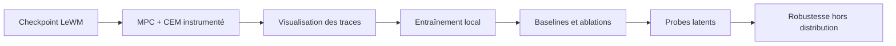

# LeWM PushT Planning Lab

Apprendre un world model visuel compact sur PushT, puis rendre le contrôle par *model predictive control* (MPC) observable : rollouts latents, recherche Cross-Entropy Method (CEM), et mesure du contrôle final.

Le projet s'inspire de [LeWorldModel (LeWM)](https://github.com/lucas-maes/le-wm) et s'appuie sur [stable-worldmodel](https://github.com/galilai-group/stable-worldmodel). Il privilégie un modèle entraînable localement sur une RTX 3090 (24 Go) plutôt qu'un modèle fondation.

> État : cadrage du projet. Voir la [roadmap](ROADMAP.md) pour les livrables et critères de réussite.

## Objectif

À partir d'une observation image `o_t`, l'encodeur produit un état latent `z_t`. Un encodeur d'action et un prédicteur apprennent la dynamique :

$$
\begin{aligned}
z_t &= E(o_t) && \text{encodage de l'observation} \\
u_t &= A(a_t) && \text{encodage de l'action} \\
\hat{z}_{t+1} &= P(z_t, u_t) && \text{prédiction du prochain état latent} \\
\mathcal{L} &= \mathcal{L}_{\mathrm{prediction}} + \lambda\,\mathcal{L}_{\mathrm{SIGReg}} && \text{apprentissage stable sans collapse}
\end{aligned}
$$

À l'exécution, un planificateur CEM échantillonne des séquences d'actions, les déroule dans le modèle latent et minimise leur distance au latent du but. Seule la première action est appliquée, puis le plan est recalculé à l'observation suivante (MPC en boucle fermée).

## Démonstration visée

L'interface de démonstration affichera simultanément :

1. **L'environnement réel** — pousseur, objet en T, cible et trajectoire exécutée.
2. **La population CEM** — candidats, élites, moyenne de la distribution et dispersion à chaque itération.
3. **Les rollouts latents** — embedding courant, embedding objectif, futurs prédits et coût terminal par candidat.
4. **Les métriques** — meilleur coût, moyenne/variance des coûts, temps de planification, erreur de prédiction multi-step, variance des embeddings et taux de réussite.

L'objectif pédagogique est de voir les séquences d'actions d'abord dispersées se concentrer, itération après itération, vers une poussée qui rapproche réellement le T de sa cible.

## Périmètre scientifique

| Question | Mesure attendue |
| --- | --- |
| Le modèle apprend-il une dynamique latente stable ? | pertes, erreur multi-step, variance des embeddings, détection du collapse |
| CEM aide-t-il à contrôler PushT ? | taux de réussite et coût final en MPC fermé |
| L'optimisation itérative aide-t-elle ? | CEM vs random shooting à budget de rollouts égal |
| Les choix de planning importent-ils ? | taux de réussite, coût final et temps de planning selon la population et l'horizon |
| Le latent encode-t-il des variables physiques utiles ? | probes pour position/orientation du T, position du pousseur, distance au but et contact |
| Le monde modèle résiste-t-il aux décalages de distribution ? | succès et erreur sous variations visuelles et physiques PushT |

### Ablations de planning

| Paramètre | Valeurs testées | Question isolée |
| --- | --- | --- |
| Population CEM `N` | 32 · 64 · 128 · 256 · 512 | Quel budget de rollouts est nécessaire ? |
| Horizon `H` | 4 · 8 · 12 · 16 | Jusqu'où faut-il anticiper pour pousser le T ? |

Pour comparer CEM et random shooting, le **nombre total de rollouts de modèle est identique**. Cela isole l'apport de la mise à jour itérative de la distribution.

Les comparaisons iCEM et, si les ressources le permettent, MPPI complètent les baselines. La comparaison centrale reste **CEM contre random shooting à budget de modèles égal**.

## Feuille de route

La [roadmap détaillée](ROADMAP.md) définit l'ordre d'implémentation, les dépendances et les critères de validation. L'ordre est volontairement strict : rendre l'évaluation de référence reproductible avant d'entraîner ou de modifier l'architecture.



## Environnement cible

- GPU : NVIDIA RTX 3090, 24 Go VRAM.
- Système : Linux ou WSL2 avec pilote CUDA compatible PyTorch.
- Python : 3.10, environnement géré avec `uv`.
- Données : PushT et checkpoints officiels LeWM.

Le checkpoint pré-entraîné sert à livrer rapidement une démonstration fiable. L'entraînement local permet ensuite de reproduire le résultat, tester SIGReg et observer les échecs de représentation. Le format de données devra être choisi selon le disque disponible : stable-worldmodel indique environ 43 Go pour HDF5 et 13 Go pour LanceDB sur son benchmark PushT.

## Installation — Phase 0

La configuration de référence est volontairement figée à Python 3.10 et à la version du code LeWM enregistrée comme sous-module Git. Sur le PC RTX 3090, installer d'abord le pilote NVIDIA, puis les prérequis système : `git`, `zstd`, `swig` et les outils de compilation (`build-essential` sous Ubuntu).

Prévoir au moins **60 Go d'espace libre** dans `STABLEWM_HOME` : le dataset officiel PushT fait 13,1 Go compressé et est décompressé localement pour l'entraînement et l'évaluation.

```bash
git clone --recurse-submodules https://github.com/AlexandreEDMOND/lewm-pusht-planning-lab.git
cd lewm-pusht-planning-lab

cp config/local.env.example config/local.env
# Modifier STABLEWM_HOME dans config/local.env si les données sont sur un autre disque.

uv sync
bash scripts/download_assets.sh all
bash scripts/check_phase0.sh --require-cuda --require-assets
bash scripts/evaluate_reference.sh 42 5
```

La dernière commande évalue cinq épisodes avec le checkpoint officiel, le seed `42`, et écrit les résultats et vidéos dans `STABLEWM_HOME/pusht/`. `scripts/check_phase0.sh` produit un rapport JSON sur Python, PyTorch/CUDA, le GPU et les assets téléchargés.

> La machine de préparation actuelle est un Mac ARM sans CUDA. Le verrouillage des dépendances et les scripts sont donc prêts, mais la validation GPU de cette phase doit être effectuée sur le PC RTX 3090.

## Référence CEM — Phase 1

La référence MPC utilise le checkpoint LeWM officiel avec une configuration CEM figée : horizon `5`, population `300`, `30` itérations, `30` élites (10 %), actions de l’environnement bornées dans `[-1, 1]`, seed `42` et cinq épisodes déterministes.

```bash
bash scripts/evaluate_phase1.sh
```

Les vidéos sont écrites dans `STABLEWM_HOME/pusht/`. Le fichier `pusht_phase1_metrics.json` enregistre les épisodes sélectionnés, le taux de réussite, le coût moyen des élites à la dernière décision MPC, le temps de planning et les versions de code. Le taux de réussite et les épisodes doivent être identiques entre exécutions ; les coûts latents terminaux sont comparés à une tolérance relative de 10 %.

## Sources et crédits

- [LeWorldModel — code officiel](https://github.com/lucas-maes/le-wm)
- [stable-worldmodel — plateforme, environnements et solveurs](https://github.com/galilai-group/stable-worldmodel)
- [Checkpoint LeWM PushT officiel](https://huggingface.co/quentinll/lewm-pusht)

Le code propre à ce dépôt sera documenté avec ses versions de dépendances, seeds, configurations et résultats afin que chaque graphique et chaque vidéo soit reproductible.
