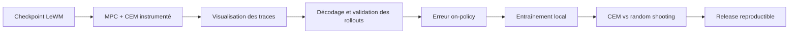
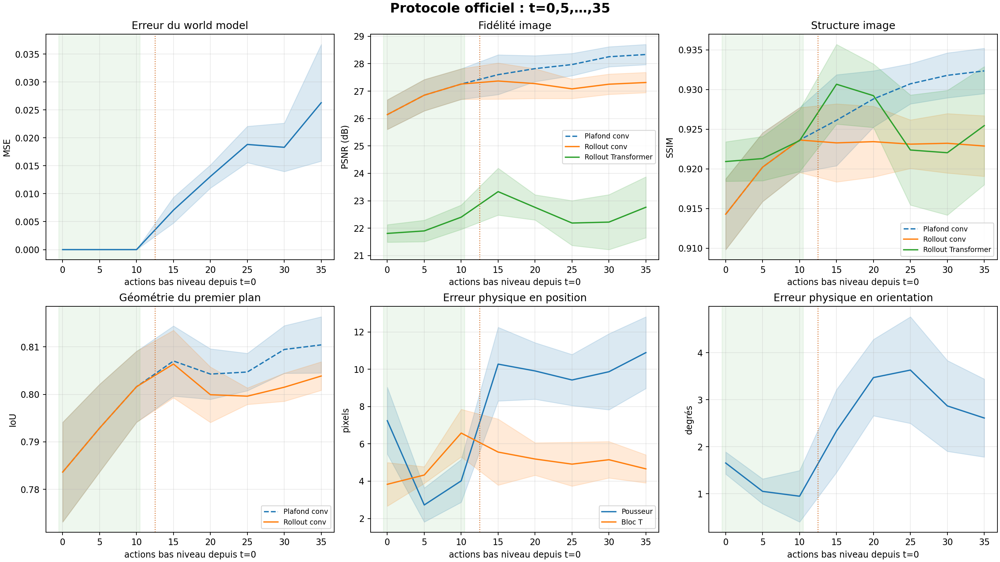

# LeWM PushT Planning Lab

Apprendre un modèle visuel compact de PushT, l'utiliser pour planifier des
actions, puis rendre chaque décision observable : futurs imaginés, recherche
Cross-Entropy Method (CEM) et résultat obtenu dans le simulateur.

Le projet s'inspire de [LeWorldModel (LeWM)](https://github.com/lucas-maes/le-wm) et s'appuie sur [stable-worldmodel](https://github.com/galilai-group/stable-worldmodel). Il privilégie un modèle entraînable localement sur une RTX 3090 (24 Go) plutôt qu'un modèle fondation.

> **État au 30 juillet 2026 : prototype avancé, pas encore version 1.** Le
> contrôle avec le checkpoint officiel, les traces CEM et le diagnostic des
> rollouts fonctionnent. L'entraînement local complet, l'erreur on-policy et les
> baselines de planning restent à valider. Voir le
> [rapport d'audit](docs/project_audit_2026-07-30.md) et la
> [roadmap](ROADMAP.md).


*De gauche à droite : scène réelle, limite du décodeur, futur prédit par LeWM et
pose physique extraite du latent. Le T gris doit rejoindre la cible verte ; le
disque bleu est le pousseur. Les trois premières images donnent le contexte,
puis le modèle prédit la suite.*

## Le projet en 30 secondes

**PushT** est une tâche de manipulation 2D : un disque bleu doit pousser un bloc
gris en forme de T jusque dans une cible verte. Le contrôleur ne reçoit pas la
bonne action directement. Il utilise un *world model* pour imaginer plusieurs
suites d'actions, puis CEM conserve les plus prometteuses et concentre
progressivement sa recherche.

Le dépôt cherche à répondre à trois questions simples :

1. le modèle prédit-il un futur physiquement utile à partir des images ?
2. CEM transforme-t-il ces prédictions en meilleur contrôle ?
3. peut-on reproduire l'ensemble localement sur une RTX 3090 ?

## Où en est le projet ?

| Élément | État | Ce que l'on peut déjà affirmer |
| --- | --- | --- |
| Environnement et assets | Fonctionnel localement | Python 3.10, CUDA, dataset et checkpoint passent le contrôle phase 0 |
| Contrôle CEM officiel | Préliminaire | 5 succès sur 5 épisodes fixes ; échantillon trop petit pour estimer le taux général |
| Traces et visualisation CEM | Presque complet | Actions, coûts, élites, distributions et latents sont enregistrés ; la trajectoire exécutée complète manque dans l'animation |
| Décodeurs et rollouts | Validé dans le protocole annoncé | Trois décodeurs, 2 048 images de test et une étude sur 128 épisodes |
| Lien erreur offline / contrôle | Exploratoire | 21 succès sur 24 cas stratifiés ; ce ratio n'est pas un taux de réussite populationnel |
| Entraînement LeWM local | Non validé | Configuration et smoke test disponibles, mais aucun run complet publié |
| CEM vs random shooting | Non commencé | Comparaison indispensable pour attribuer un gain à l'optimisation CEM |

**Conclusion : le démonstrateur est crédible, mais le projet annoncé n'est pas
terminé.** La [définition de “terminé”](ROADMAP.md#définition-de-terminé) sépare
un démonstrateur reproductible d'une version 1 scientifique.

### Pour explorer les preuves

- [Audit complet du projet](docs/project_audit_2026-07-30.md)
- [Roadmap et chemin critique](ROADMAP.md)
- [Rapport de faisabilité des décodeurs](docs/visual_decoder_feasibility.md)
- [Généralisation sur 128 épisodes et lien avec le contrôle](docs/rollout_generalization.md)
- [Résultats bruts versionnés](docs/results/)

## Objectif

À partir d'une observation image `o_t`, l'encodeur produit un état latent `z_t`. Un encodeur d'action et un prédicteur apprennent la dynamique :

$$
\begin{aligned}
z_t &= E(o_t) && \text{encodage de l'observation} \\
u_t &= A(a_t) && \text{encodage de l'action} \\
\hat{z}_{t+1} &= P(z_t, u_t) && \text{prédiction du prochain état latent} \\
\mathcal{L} &= \mathcal{L}_{\mathrm{prediction}} + \lambda\,\mathcal{L}_{\mathrm{SIGReg}} && \text{apprentissage stable sans collapse}
\end{aligned}
$$

À l'exécution, un planificateur CEM échantillonne des séquences d'actions, les déroule dans le modèle latent et minimise leur distance au latent du but. Le protocole officiel exécute les cinq blocs du plan, soit 25 actions élémentaires, avant de replanifier. Une ablation plus fermée avec `receding_horizon=1` est prévue séparément.

## Démonstration et limite actuelle

Le générateur actuel affiche :

1. **L'environnement réel** — pousseur, objet en T, cible et frame exacte de la décision.
2. **La population CEM** — candidats, élites, moyenne de la distribution et dispersion à chaque itération.
3. **Les rollouts latents** — embedding courant, embedding objectif, futurs prédits et coût terminal par candidat.
4. **La convergence** — meilleur coût, coût moyen des élites et contraction de la dispersion.

L'objectif pédagogique est de voir les séquences d'actions d'abord dispersées se concentrer, itération après itération, vers une poussée qui rapproche réellement le T de sa cible.

La vidéo actuelle garde la frame PushT fixe pendant les itérations d'une
décision. Une animation qui relie les décisions successives à toute la
trajectoire réellement exécutée, avec temps de planning, erreur multi-step et
résultat final, reste à publier.

## Périmètre scientifique

| Question | Mesure attendue | État |
| --- | --- | --- |
| Le modèle apprend-il une dynamique latente stable ? | pertes, erreur multi-step, variance des embeddings, détection du collapse | À faire sur l'entraînement local |
| CEM aide-t-il à contrôler PushT ? | taux de réussite et coût final en MPC fermé | Référence préliminaire |
| L'optimisation itérative aide-t-elle ? | CEM vs random shooting à budget de rollouts égal | À faire |
| Les choix de planning importent-ils ? | taux de réussite, coût final et temps de planning selon la population et l'horizon | À faire |
| Le latent encode-t-il des variables physiques utiles ? | probes pour position/orientation du T, position du pousseur, distance au but et contact | Partiel via un décodeur non linéaire |
| Le world model résiste-t-il aux décalages de distribution ? | succès et erreur sous variations visuelles et physiques PushT | Extension |

### Ablations de planning

| Paramètre | Valeurs prévues | Question isolée |
| --- | --- | --- |
| Population CEM `N` | 32 · 64 · 128 · 256 · 512 | Quel budget de rollouts est nécessaire ? |
| Horizon `H` | 4 · 8 · 12 · 16 | Jusqu'où faut-il anticiper pour pousser le T ? |

Pour comparer CEM et random shooting, le **nombre total de rollouts de modèle est identique**. Cela isole l'apport de la mise à jour itérative de la distribution.

Les comparaisons iCEM et, si les ressources le permettent, MPPI complètent les baselines. La comparaison centrale reste **CEM contre random shooting à budget de modèles égal**.

## Feuille de route

La [roadmap détaillée](ROADMAP.md) définit l'ordre d'implémentation, les dépendances et les critères de validation. L'ordre est volontairement strict : rendre l'évaluation de référence reproductible avant d'entraîner ou de modifier l'architecture.


```mermaid
flowchart LR
    A[Checkpoint LeWM] --> B[MPC + CEM instrumenté]
    B --> C[Visualisation des traces]
    C --> D[Décodage et validation des rollouts]
    D --> E[Erreur on-policy]
    E --> F[Entraînement local]
    F --> G[CEM vs random shooting]
    G --> H[Release reproductible]
```

## Environnement cible

- GPU : NVIDIA RTX 3090, 24 Go VRAM.
- Système : Linux ou WSL2 avec pilote CUDA compatible PyTorch.
- Python : 3.10, environnement géré avec `uv`.
- Données : PushT et checkpoints officiels LeWM.

Le checkpoint pré-entraîné sert à établir rapidement une référence. L'entraînement local doit ensuite reproduire le résultat, tester SIGReg et observer les échecs de représentation. Le workflow versionné utilise actuellement le dataset HDF5 ; [stable-worldmodel](https://github.com/galilai-group/stable-worldmodel) mesure environ 43 Go pour ce format et 13 Go pour LanceDB sur son benchmark PushT.

## Installation — Phase 0

La configuration de référence est volontairement figée à Python 3.10 et à la version du code LeWM enregistrée comme sous-module Git. Sur le PC RTX 3090, installer d'abord le pilote NVIDIA, puis les prérequis système : `git`, `zstd`, `swig` et les outils de compilation (`build-essential` sous Ubuntu).

Prévoir au moins **60 Go d'espace libre** dans `STABLEWM_HOME` : le dataset officiel PushT fait 13,1 Go compressé et est décompressé localement pour l'entraînement et l'évaluation.

```bash
git clone --recurse-submodules https://github.com/AlexandreEDMOND/lewm-pusht-planning-lab.git
cd lewm-pusht-planning-lab

cp config/local.env.example config/local.env
# Modifier STABLEWM_HOME dans config/local.env si les données sont sur un autre disque.

uv sync
bash scripts/download_assets.sh all
bash scripts/check_phase0.sh --require-cuda --require-assets
bash scripts/evaluate_reference.sh 42 5
```

La dernière commande évalue cinq épisodes avec le checkpoint officiel, le seed `42`, et écrit les résultats et vidéos dans `STABLEWM_HOME/pusht/`. `scripts/check_phase0.sh` produit un rapport JSON sur Python, PyTorch/CUDA, le GPU et les assets téléchargés.

La chaîne a été validée sur une NVIDIA RTX 3090 avec PyTorch 2.13.0, CUDA 13.0 et Python 3.10.20.

### Vérifications rapides

Le contrôle matériel et les tests n'utilisent pas la même commande :

```bash
bash scripts/check_phase0.sh --require-cuda --require-assets
```

```bash
cd third_party/le-wm
uv run --project ../.. python -m unittest discover -s tests -v
```

Au 30 juillet 2026, le contrôle phase 0 et les 12 tests passent sur la machine
RTX 3090 auditée. Les tests doivent être lancés depuis le sous-module pour que
son module `cem_trace` soit importable.

## Référence CEM — Phase 1

La référence MPC utilise le checkpoint LeWM officiel avec une configuration CEM figée : horizon `5`, population `300`, `30` itérations, `30` élites (10 %), actions de l’environnement bornées dans `[-1, 1]`, seed `42` et cinq épisodes déterministes.

```bash
bash scripts/evaluate_phase1.sh
```

Les vidéos sont écrites dans `STABLEWM_HOME/pusht/`. Le fichier `pusht_phase1_metrics.json` enregistre les épisodes sélectionnés, le taux de réussite, le coût moyen des élites à la dernière décision MPC, le temps de planning et les versions de code. Le taux de réussite et les épisodes doivent être identiques entre exécutions ; les coûts latents terminaux sont comparés à une tolérance relative de 10 %.

## Traces CEM — Phase 2

La phase 2 reprend **strictement** le protocole de phase 1 et enregistre une trace complète à chaque décision MPC :

```bash
bash scripts/evaluate_phase2.sh
```

Les traces sont sauvegardées dans `STABLEWM_HOME/pusht/cem_traces/`, sous la forme d’un fichier `decision_XXXX.npz` et de son métadonnée `decision_XXXX.json`. Les deux premières dimensions de chaque tableau sont toujours `(itération_CEM, environnement)`.

| Tableau | Contenu |
| --- | --- |
| `candidates`, `costs` | Population d’actions et coût de chaque candidat |
| `elite_indices`, `elite_costs` | Sélection des élites et leurs coûts |
| `mean_before`, `std_before`, `mean_after`, `std_after` | Distribution CEM avant et après la mise à jour |
| `predicted_emb`, `goal_emb` | Rollouts latents et latent objectif utilisés par le coût |

Le test unitaire vérifie que l’instrumentation conserve les actions et coûts du CEM de référence pour une seed identique, et que les élites et mises à jour de distribution peuvent être reconstruites à partir de la trace.

Le métadonnée de chaque décision enregistre aussi sa provenance d’exécution : épisode et step de départ, frame exacte du rollout, et toutes les actions post-traitées envoyées à PushT. Cela relie la recherche dans l’espace d’action normalisé à l’action physique effectivement appliquée.

## Vidéo de planning — Phase 3

Le générateur de phase 3 assemble un rollout réel PushT et une décision CEM sauvegardée. Chaque image correspond à une itération CEM et montre la population, les élites, la moyenne, les coûts, la dispersion et les rollouts latents.

```bash
bash scripts/visualize_phase3.sh
```

La vidéo par défaut est écrite dans `STABLEWM_HOME/pusht/phase3_cem_decision_0000_env_0.mp4`, accompagnée d’un fichier JSON qui décrit ses sources et panneaux. Son panneau PushT montre la **frame exacte** du rollout au moment de la décision et l’action physique post-traitée réellement envoyée à l’environnement ; il reste fixe pendant les 30 itérations et ne relie pas encore les décisions successives à la trajectoire complète. Les coordonnées de population affichées restent les **coordonnées normalisées du modèle** conservées dans la trace ; elles ne sont pas confondues avec l’action physique. Les latents sont affichés en PCA 2D uniquement pour comparer leur évolution relative.


*Aperçu à l’itération 17/30 : la population s’est concentrée, le coût des élites a chuté, la frame PushT est celle de la décision tracée et la projection PCA sert uniquement à comparer les rollouts latents.*

## Décodage des rollouts — Phase 3 bis

Trois décodeurs figent le diagnostic du latent sans modifier le world model ni
le coût CEM : convolution vers RGB, Transformer à 196 requêtes vers patches RGB,
et MLP vers l'état physique PushT. La convolution donne le rendu primaire ; le
rendu structuré sert à mesurer précisément les erreurs de pose.

```bash
bash scripts/run_visual_decoder_feasibility.sh --rebuild-cache
```

Sur quatre épisodes de test et le protocole officiel `t=0,5,…,35`, les frames
prédites atteignent en moyenne 27,26 dB de PSNR, 0,923 de SSIM et 0,802 d'IoU
du premier plan. Le stress test à 90 actions reste visuellement lisible, mais
l'erreur terminale moyenne du T atteint 13,42 px et 7,49°.



Le [rapport de faisabilité complet](docs/visual_decoder_feasibility.md) contient
la comparaison des décodeurs, les quatre GIFs, le stress test et le protocole
de reproduction déterministe.

### Généralisation et contrôle

L'évaluation étendue couvre les 128 épisodes de test avec une fenêtre uniforme
par épisode. À `t=35`, l'erreur médiane du T est de 6,74 px et 2,02°, mais le
P95 atteint 25,35 px et 18,30°. La MSE latente est modérément corrélée à
l'erreur physique sur la même trajectoire experte.

Sur un sous-ensemble CEM stratifié de 24 cas, 21 réussissent. Ce sous-ensemble
couvre le spectre de risque mais n'est pas un échantillon représentatif : son
ratio de succès ne doit pas être lu comme une estimation du taux général.
L'erreur offline ne prédit toutefois pas les trois échecs (`AUC=0,57`), car CEM choisit des
actions différentes des actions expertes utilisées pour mesurer le rollout.


Le [rapport de généralisation](docs/rollout_generalization.md) présente les
quantiles, les interactions libre/contact/poussée, les cas extrêmes et le lien
avec le contrôle.

## Sources et crédits

- [LeWorldModel — code officiel](https://github.com/lucas-maes/le-wm)
- [stable-worldmodel — plateforme, environnements et solveurs](https://github.com/galilai-group/stable-worldmodel)
- [Checkpoint LeWM PushT officiel](https://huggingface.co/quentinll/lewm-pusht)

Les rapports versionnés enregistrent les seeds, configurations, hashes de
checkpoint et résultats disponibles. Les métriques des phases 1–3, les traces
complètes et leurs vidéos sont encore locales et devront être publiées avec une
release.

Le sous-module LeWM et le checkpoint officiel sont annoncés sous licence MIT.
Le dépôt racine ne possède pas encore de fichier de licence propre : ce point
doit être réglé avant de considérer la distribution du projet comme finalisée.
