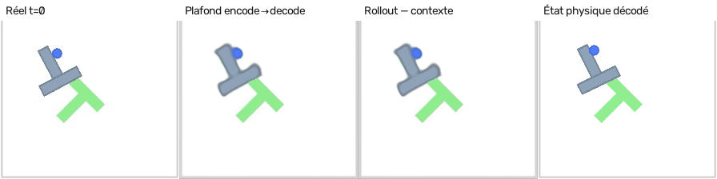
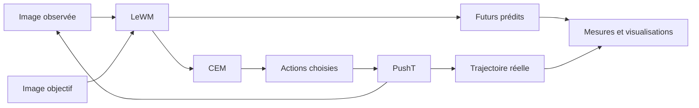
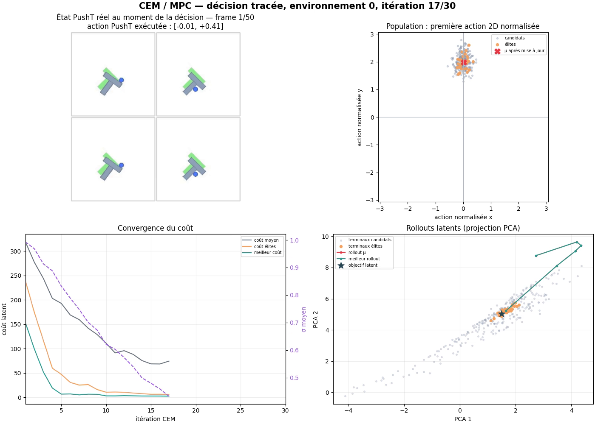
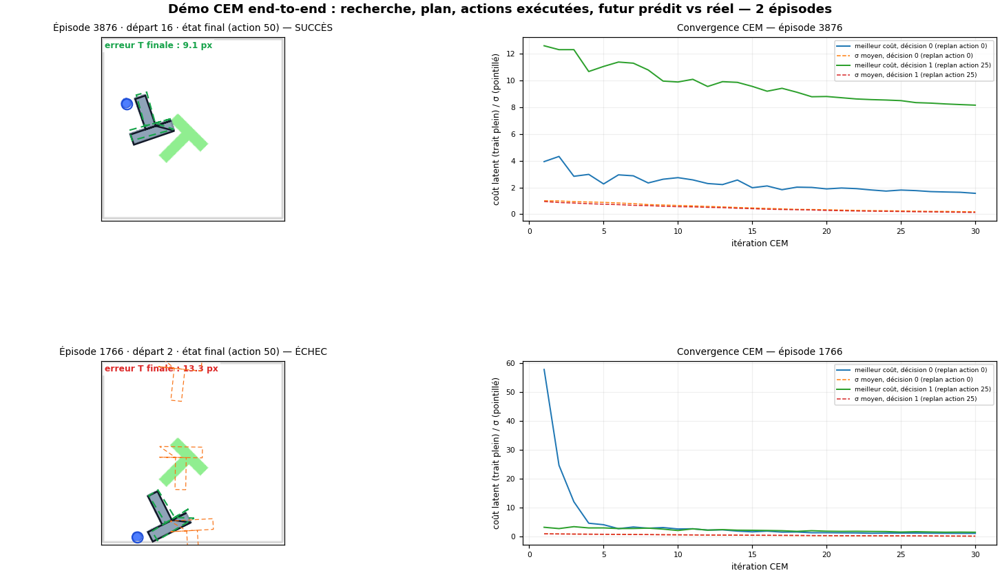
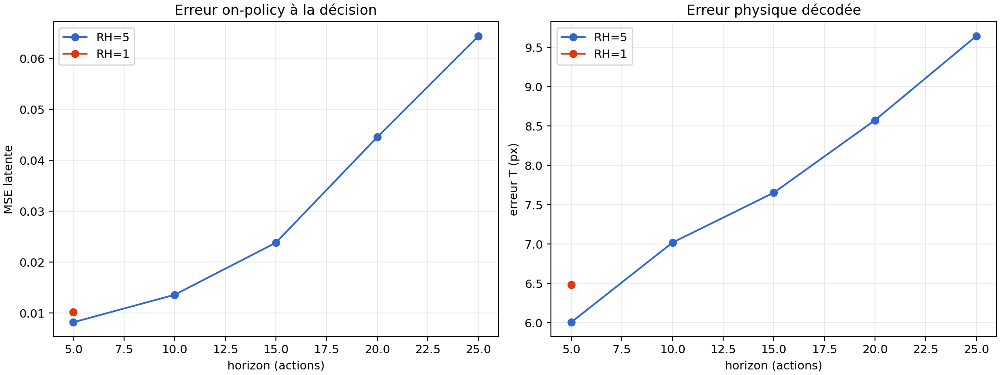
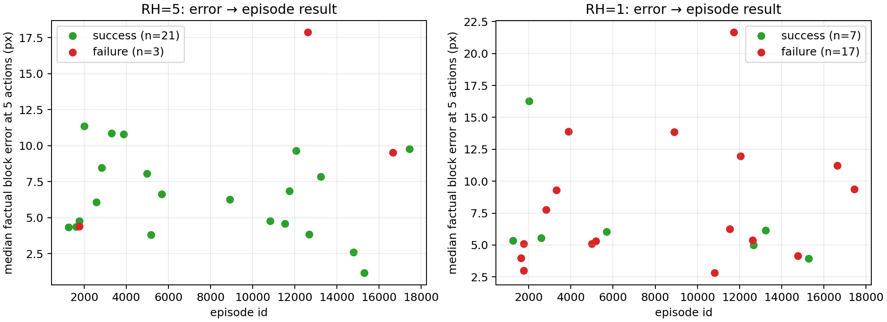

# LeWM PushT Planning Lab

Un laboratoire visuel pour comprendre comment un *world model* imagine le
futur, comment Cross-Entropy Method (CEM) choisit des actions et ce qui se passe
réellement dans le simulateur PushT.

Le projet s'appuie sur
[LeWorldModel (LeWM)](https://github.com/lucas-maes/le-wm) et
[stable-worldmodel](https://github.com/galilai-group/stable-worldmodel). Il est
conçu pour être exécuté localement avec un GPU grand public de 24 Go.



*Le T gris doit rejoindre la cible verte. Le disque bleu est le pousseur. Les
premières images donnent le contexte ; LeWM prédit ensuite l'évolution de la
scène sous une suite d'actions.*

## PushT en une minute

PushT est une tâche de manipulation 2D. À partir d'images, un disque doit pousser
un bloc en forme de T jusqu'à une cible.

Le contrôleur procède en boucle :

1. LeWM transforme l'observation et l'objectif en représentations latentes.
2. Le modèle prédit les futurs associés à plusieurs suites d'actions.
3. CEM conserve les candidats les moins coûteux et concentre progressivement sa
   recherche.
4. Les actions retenues sont envoyées à PushT, puis le résultat réel est comparé
   au futur imaginé.


```mermaid
flowchart LR
    O[Image observée] --> W[LeWM]
    G[Image objectif] --> W
    W --> C[CEM]
    C --> A[Actions choisies]
    A --> E[PushT]
    E --> O
    W --> P[Futurs prédits]
    E --> R[Trajectoire réelle]
    P --> D[Mesures et visualisations]
    R --> D
```

L'instrumentation relie chaque décision aux actions réellement exécutées, aux
latents prédits, aux états obtenus et au coût de planification. Elle permet
d'observer les réussites, les échecs et les écarts entre prédiction et contrôle.

## Voir le modèle raisonner

### Recherche CEM



La population d'actions se resserre au fil des itérations. Les élites déterminent
la prochaine distribution, tandis que les courbes montrent la convergence du
coût et la dispersion de la recherche.

### Démonstrateur reproductible de bout en bout

Une commande unique relie, sur deux épisodes PushT fixes, la recherche CEM
(population, élites, convergence), les plans sélectionnés, les actions
réellement exécutées, les futurs prédits par LeWM, la trajectoire obtenue et le
résultat final — avec provenance propre, traces compactes versionnées et
hashes.



```bash
bash scripts/run_reproducible_cem_demo.sh
```

Le [rapport de la démonstration](docs/cem_reproducible_demo.md) explique ce que
montrent et ne montrent pas les animations
([succès](docs/assets/cem_demo_success.gif),
[échec](docs/assets/cem_demo_failure.gif)).

### Futur prédit et futur réel



Les rollouts sont évalués dans l'espace latent et après décodage de la position
et de l'orientation du T. Les mesures distinguent le plan imaginé au moment de
la décision du flux d'actions finalement exécuté après replanification.

### Erreur et résultat du contrôle



Les graphiques restent liés à leurs CSV, JSON, configurations, seeds, commits et
hashes de checkpoint afin qu'une image ne soit jamais la seule preuve disponible.

## Démarrage rapide

Pré-requis : Linux ou WSL2, pilote NVIDIA compatible, Python 3.10, `git`, `uv`,
`zstd`, `swig` et les outils de compilation. Les données et checkpoints demandent
environ 60 Go d'espace libre.

```bash
git clone --recurse-submodules \
  https://github.com/AlexandreEDMOND/lewm-pusht-planning-lab.git
cd lewm-pusht-planning-lab

cp config/local.env.example config/local.env
# Adapter STABLEWM_HOME dans config/local.env si nécessaire.

uv sync
bash scripts/download_assets.sh all
bash scripts/check_phase0.sh --require-cuda --require-assets
bash scripts/evaluate_reference.sh 42 5
bash scripts/run_reproducible_cem_demo.sh
```

Les artefacts lourds sont écrits sous `STABLEWM_HOME` et ne sont pas ajoutés au
dépôt Git.

Pour lancer l'étude complète de l'erreur sous les actions CEM :

```bash
source scripts/_env.sh
uv run --project . python scripts/run_on_policy_cem_error.py --batch-size 4
```

## Organisation du dépôt

| Chemin | Rôle |
| --- | --- |
| `third_party/le-wm/` | Fork LeWM épinglé comme sous-module |
| `scripts/` | Évaluation, instrumentation, décodage et génération des rapports |
| `config/` | Configuration reproductible et chemins locaux |
| `docs/assets/` | Figures et animations légères |
| `docs/results/` | CSV et JSON versionnés |
| `ROADMAP.md` | Suivi du développement et critères de validation |

## Documentation

- [Rapport de validation : tests, résultats et limites](docs/validation_report.md)
- [Suivi du développement](ROADMAP.md)
- [Démonstrateur CEM reproductible de bout en bout](docs/cem_reproducible_demo.md)
- [Erreur on-policy sous les actions choisies par CEM](docs/on_policy_cem_error.md)
- [Généralisation des rollouts sur 128 épisodes](docs/rollout_generalization.md)
- [Faisabilité du décodage visuel](docs/visual_decoder_feasibility.md)
- [Résultats bruts versionnés](docs/results/)

## Sources et crédits

- [LeWorldModel — dépôt officiel](https://github.com/lucas-maes/le-wm)
- [stable-worldmodel — environnements et solveurs](https://github.com/galilai-group/stable-worldmodel)
- [Checkpoint LeWM PushT officiel](https://huggingface.co/quentinll/lewm-pusht)

Les rapports indiquent la provenance des expériences et les limites
d'interprétation. Les conditions de réutilisation des dépendances, données et
checkpoints restent celles de leurs projets respectifs.
