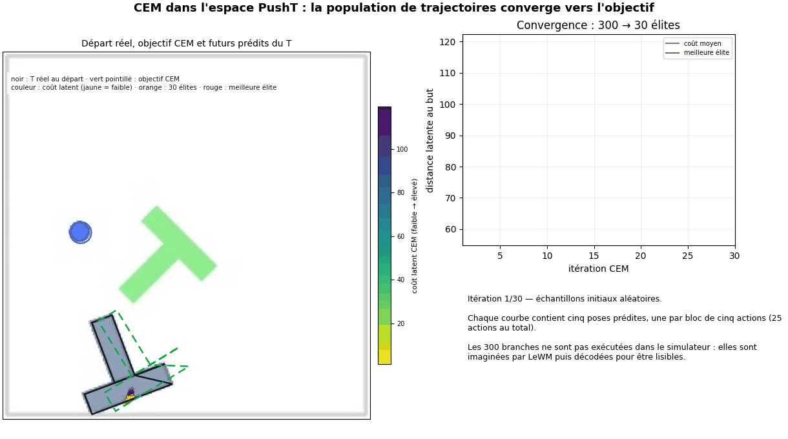

# LeWM PushT Planning Lab

Un laboratoire visuel pour comprendre comment un *world model* imagine le
futur, comment Cross-Entropy Method (CEM) choisit des actions et ce qui se passe
réellement dans le simulateur PushT.

Le projet s'appuie sur
[LeWorldModel (LeWM)](https://github.com/lucas-maes/le-wm) et
[stable-worldmodel](https://github.com/galilai-group/stable-worldmodel). Il est
conçu pour être exécuté localement avec un GPU grand public de 24 Go.

## PushT en une minute

PushT est une tâche de manipulation 2D. À partir d'images, un disque doit pousser
un bloc en forme de T jusqu'à une cible.

Le contrôleur procède en boucle : l'image devient un embedding, le predictor
prédit l'embedding suivant sous un bloc d'actions, puis ce nouvel embedding est
réinjecté pour imaginer la suite. Le décodeur visuel rend ces embeddings
lisibles ; il n'est pas réinjecté dans le modèle.


*Comment lire ce schéma : en haut, **une** suite d'actions fait avancer le
world model de `z₀` à `z₁`, puis `z₂`, etc. En bas, CEM imagine **300** suites
de 25 actions, compare leur embedding final à celui de l'image objectif, garde
les **30** distances les plus faibles, puis recommence avec une distribution
d'actions plus concentrée.*

## Voir le modèle raisonner

### 18 pas du world model : réel vs prédit


*Ce GIF répond à la question « le world model imagine-t-il la même suite que le
simulateur ? ». À partir des mêmes images initiales et actions enregistrées, il
compare le réel à la prédiction autorégressive. Le modèle actuel travaille par
blocs de cinq actions : **18 pas du modèle = 90 actions PushT**, et non 18
actions élémentaires. Les trois premières images sont le contexte ; les
suivantes sont prédites.*

Les mêmes GIFs sont publiés pour trois autres positions initiales :
[épisode 6834](docs/assets/visual_decoder_rollout_06834.gif),
[épisode 8904](docs/assets/visual_decoder_rollout_08904.gif) et
[épisode 16201](docs/assets/visual_decoder_rollout_16201.gif).

### CEM : 300 trajectoires imaginées, 30 élites


*Chaque trait est un futur du **T** imaginé par LeWM puis décodé en pose
PushT : il contient cinq points, soit cinq blocs de cinq actions. Jaune signifie
un coût latent faible ; orange signifie « fait partie des 30 élites » ; rouge
signifie meilleure élite. Seul le plan final est réellement envoyé au
simulateur. À l'itération 1 les candidats sont aléatoires ; aux suivantes ils
sont tirés de la distribution CEM mise à jour.*



*Ce second GIF évite une lecture trompeuse : une population peut converger vers
un coût latent faible tout en conduisant à un échec physique. Les lignes sont
des prédictions du modèle, non 300 essais réels de PushT.*

Pour régénérer ces deux GIFs depuis les traces complètes de la démo :

```bash
bash scripts/render_cem_population.sh
```

### Démonstrateur reproductible de bout en bout

Une commande unique relie, sur deux épisodes PushT fixes, la recherche CEM
(population, élites, convergence), les plans sélectionnés, les actions
réellement exécutées, les futurs prédits par LeWM, la trajectoire obtenue et le
résultat final — avec provenance propre, traces compactes versionnées et
hashes.


*Cette image compare le résultat réel final des deux épisodes fixes. En haut,
le planificateur réussit ; en bas, il échoue. Les courbes à droite montrent que
le coût latent peut diminuer dans les deux cas : il ne garantit donc pas à lui
seul le succès dans le simulateur.*

```bash
bash scripts/run_reproducible_cem_demo.sh
```

Le [rapport de la démonstration](docs/cem_reproducible_demo.md) explique ce que
montrent et ne montrent pas les animations
([succès](docs/assets/cem_demo_success.gif),
[échec](docs/assets/cem_demo_failure.gif)).

### Futur prédit et futur réel


Les rollouts sont évalués dans l'espace latent et après décodage de la position
et de l'orientation du T. Les mesures distinguent le plan imaginé au moment de
la décision du flux d'actions finalement exécuté après replanification.

*Cette figure répond à « à quel horizon le modèle dérive-t-il ? ». Elle montre
que les erreurs physique et latente augmentent généralement quand le rollout se
prolonge ; elle ne prouve pas, seule, la cause d'un échec de contrôle.*

### Erreur et résultat du contrôle


Les graphiques restent liés à leurs CSV, JSON, configurations, seeds, commits et
hashes de checkpoint afin qu'une image ne soit jamais la seule preuve disponible.

*Cette figure compare descriptivement erreur et résultat. Elle montre notamment
que l'erreur mesurée ne suffit pas à expliquer la dégradation observée quand le
contrôleur replanifie à chaque action (`RH=1`).*

### Comparaison VLA : critère obligatoire, résultat non encore publié

Le projet comparera LeWM+CEM à un VLA sur les **mêmes** épisodes, objectifs,
observations visuelles, budget d'actions et critère de réussite. Le VLA recevra
l'image courante et l'image objectif comme deux vues, plus l'instruction
constante « pousser le T dans la cible », sans état privilégié. Le protocole
complet est dans [la spécification VLA](docs/vla_comparison_protocol.md).

Il serait trompeur d'écrire dès maintenant qu'un VLA est meilleur : aucun VLA
PushT n'a encore été entraîné et évalué selon ce protocole. Le résultat — quel
qu'il soit — sera publié avec les mêmes métriques, seeds, coûts de calcul et
vidéos que LeWM+CEM.

### Guide rapide de tous les visuels

| Visuel | Ce qu'il représente | Ce qu'il permet de conclure |
| --- | --- | --- |
| Schéma LeWM+CEM | La circulation images → embeddings → actions → futurs et le tri CEM 300 → 30. | Le décodeur explique les latents ; CEM optimise une distance latente. |
| GIF rollout 18 pas (4 départs) | Même séquence d'actions dans le réel et dans le rollout autorégressif. | Le modèle suit souvent la scène à court terme mais dérive avec l'horizon. |
| GIFs population CEM | 300 futurs du T prédits à chaque itération ; 30 élites en orange. | La recherche se concentre, mais les branches sont des prédictions et non des essais réels. |
| Synthèse CEM succès/échec | Deux contrôles complets avec leurs coûts et états finaux. | Un coût latent faible n'est pas une preuve suffisante de succès physique. |
| Erreur par horizon | Écart latent et physique à plusieurs horizons. | L'erreur longue portée croît et doit être suivie pendant le planning. |
| Erreur vs résultat | Cas réussis/échoués de l'étude on-policy. | L'erreur seule ne rend pas compte de tous les échecs, en particulier RH=1. |

## Démarrage rapide

Pré-requis : Linux ou WSL2, pilote NVIDIA compatible, Python 3.10, `git`, `uv`,
`zstd`, `swig` et les outils de compilation. Les données et checkpoints demandent
environ 60 Go d'espace libre.

```bash
git clone --recurse-submodules \
  https://github.com/AlexandreEDMOND/lewm-pusht-planning-lab.git
cd lewm-pusht-planning-lab

cp config/local.env.example config/local.env
# Adapter STABLEWM_HOME dans config/local.env si nécessaire.

uv sync
bash scripts/download_assets.sh all
bash scripts/check_phase0.sh --require-cuda --require-assets
bash scripts/evaluate_reference.sh 42 5
bash scripts/run_reproducible_cem_demo.sh
```

Les artefacts lourds sont écrits sous `STABLEWM_HOME` et ne sont pas ajoutés au
dépôt Git.

Pour lancer l'étude complète de l'erreur sous les actions CEM :

```bash
source scripts/_env.sh
uv run --project . python scripts/run_on_policy_cem_error.py --batch-size 4
```

## Organisation du dépôt

| Chemin | Rôle |
| --- | --- |
| `third_party/le-wm/` | Fork LeWM épinglé comme sous-module |
| `scripts/` | Évaluation, instrumentation, décodage et génération des rapports |
| `config/` | Configuration reproductible et chemins locaux |
| `docs/assets/` | Figures et animations légères |
| `docs/results/` | CSV et JSON versionnés |
| `ROADMAP.md` | Suivi du développement et critères de validation |

## Documentation

- [Rapport de validation : tests, résultats et limites](docs/validation_report.md)
- [Suivi du développement](ROADMAP.md)
- [Démonstrateur CEM reproductible de bout en bout](docs/cem_reproducible_demo.md)
- [Erreur on-policy sous les actions choisies par CEM](docs/on_policy_cem_error.md)
- [Généralisation des rollouts sur 128 épisodes](docs/rollout_generalization.md)
- [Faisabilité du décodage visuel](docs/visual_decoder_feasibility.md)
- [Résultats bruts versionnés](docs/results/)

## Sources et crédits

- [LeWorldModel — dépôt officiel](https://github.com/lucas-maes/le-wm)
- [stable-worldmodel — environnements et solveurs](https://github.com/galilai-group/stable-worldmodel)
- [Checkpoint LeWM PushT officiel](https://huggingface.co/quentinll/lewm-pusht)

Les rapports indiquent la provenance des expériences et les limites
d'interprétation. Les conditions de réutilisation des dépendances, données et
checkpoints restent celles de leurs projets respectifs.
