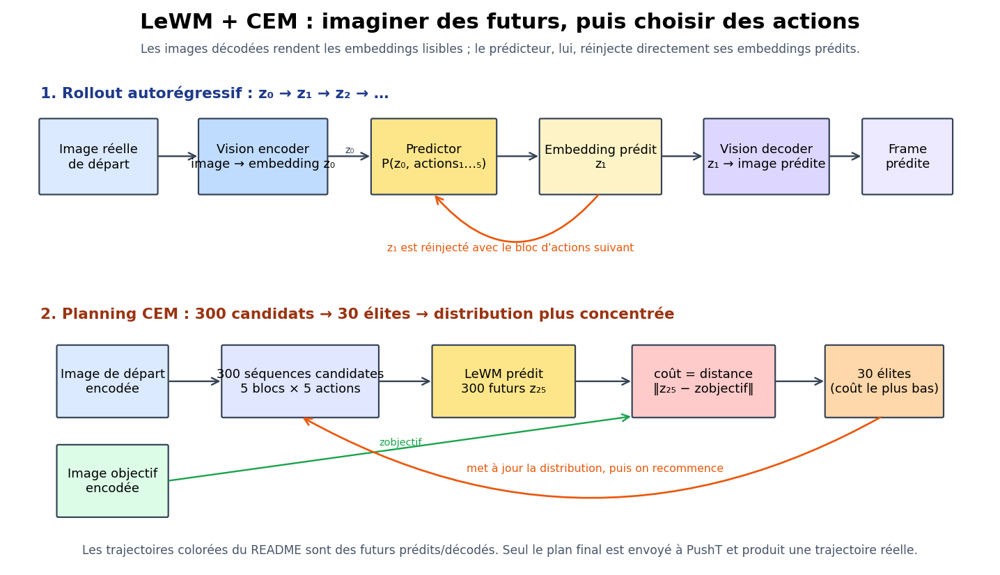
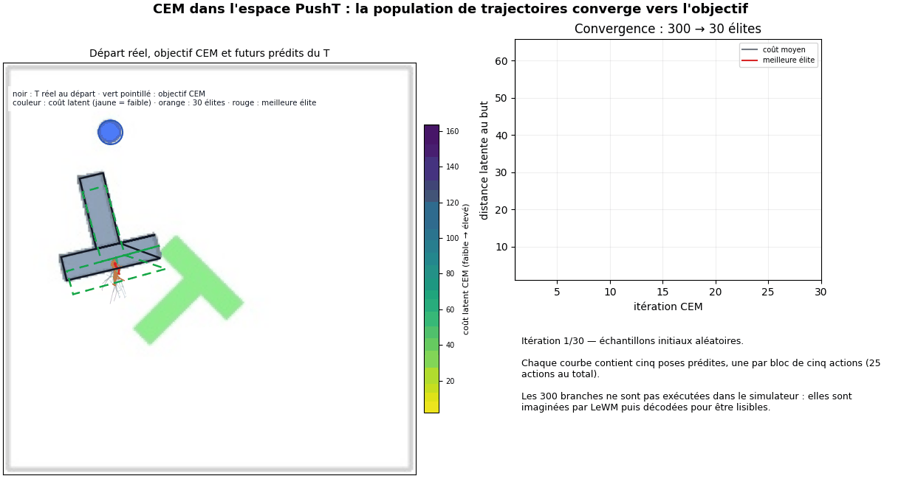
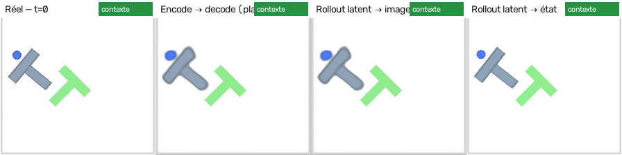

# LeWM PushT Planning Lab

Un laboratoire visuel pour comprendre comment un *world model* imagine le
futur, comment Cross-Entropy Method (CEM) choisit des actions et ce qui se passe
réellement dans le simulateur PushT.

Le projet s'appuie sur
[LeWorldModel (LeWM)](https://github.com/lucas-maes/le-wm) et
[stable-worldmodel](https://github.com/galilai-group/stable-worldmodel). Il est
conçu pour être exécuté localement avec un GPU grand public de 24 Go.

## PushT en une minute

PushT est une tâche de manipulation 2D. À partir d'images, un disque doit pousser
un bloc en forme de T jusqu'à une cible.

Le contrôleur procède en boucle : l'image devient un embedding, le predictor
prédit l'embedding suivant sous un bloc d'actions, puis ce nouvel embedding est
réinjecté pour imaginer la suite. Le décodeur visuel rend ces embeddings
lisibles ; il n'est pas réinjecté dans le modèle.



*Comment lire ce schéma : en haut, **une** suite d'actions fait avancer le
world model de `z₀` à `z₁`, puis `z₂`, etc. En bas, CEM imagine **300** suites
de 25 actions, compare leur embedding final à celui de l'image objectif, garde
les **30** distances les plus faibles, puis recommence avec une distribution
d'actions plus concentrée.*

## Voir le modèle raisonner

### CEM : 300 trajectoires imaginées, 30 élites



*Chaque trait part exactement de la boule bleue — le pousseur — puis suit son
futur imaginé par LeWM et décodé en pose PushT. Il contient cinq positions
prédites, soit cinq blocs de cinq actions. La couleur continue va de **jaune**
(coût faible) à **bleu/violet** (coût élevé) ; orange signifie « fait partie des
30 élites » ; noir signifie meilleure élite. Seul le plan final est envoyé au
simulateur. À l'itération 1 les candidats sont aléatoires ; aux suivantes ils
sont tirés de la distribution CEM mise à jour.*

Pour régénérer ces deux GIFs depuis les traces complètes de la démo :

```bash
bash scripts/render_cem_population.sh
```

### 18 pas du world model : réel vs prédit



*Ce GIF répond à la première question : « le world model imagine-t-il une suite
semblable à celle du simulateur ? ». Les trois premières images, marquées
**contexte**, sont les images réelles données à LeWM aux temps `t=0`, `t=5` et
`t=10`. Les suivantes, marquées **prédit**, sont imaginées en chaîne par le
modèle à partir des actions enregistrées.*

Les quatre panneaux sont, de gauche à droite : le **réel** ; le décodage d'un
**latent réel** (la limite du décodeur) ; l'**image imaginée** par le rollout ;
et le même rollout rendu en **poses PushT** pour rendre les écarts lisibles.
Le modèle actuel travaille par blocs de cinq actions : **18 pas du modèle = 90
actions PushT**, et non 18 actions élémentaires.

Les mêmes GIFs sont publiés pour trois autres positions initiales :
[épisode 6834](docs/assets/visual_decoder_rollout_06834.gif),
[épisode 8904](docs/assets/visual_decoder_rollout_08904.gif) et
[épisode 16201](docs/assets/visual_decoder_rollout_16201.gif).

### Réponse courte

Oui, les visuels répondent au but initial : LeWM peut imaginer une évolution
visuelle à partir d'images et d'actions, puis CEM peut utiliser ces futurs pour
concentrer sa recherche vers un plan prometteur. Cela ne démontre pas encore un
taux de réussite général ni qu'un VLA est meilleur : ces questions restent dans
la documentation de recherche, pas dans cette présentation.

## Démarrage rapide

Pré-requis : Linux ou WSL2, pilote NVIDIA compatible, Python 3.10, `git`, `uv`,
`zstd`, `swig` et les outils de compilation. Les données et checkpoints demandent
environ 60 Go d'espace libre.

```bash
git clone --recurse-submodules \
  https://github.com/AlexandreEDMOND/lewm-pusht-planning-lab.git
cd lewm-pusht-planning-lab

cp config/local.env.example config/local.env
# Adapter STABLEWM_HOME dans config/local.env si nécessaire.

uv sync
bash scripts/download_assets.sh all
bash scripts/check_phase0.sh --require-cuda --require-assets
bash scripts/evaluate_reference.sh 42 5
```

Les artefacts lourds sont écrits sous `STABLEWM_HOME` et ne sont pas ajoutés au
dépôt Git.

## Organisation du dépôt

| Chemin | Rôle |
| --- | --- |
| `third_party/le-wm/` | Fork LeWM épinglé comme sous-module |
| `scripts/` | Évaluation, instrumentation, décodage et génération des rapports |
| `config/` | Configuration reproductible et chemins locaux |
| `docs/assets/` | Figures et animations légères |
| `docs/results/` | CSV et JSON versionnés |
| `ROADMAP.md` | Suivi du développement et critères de validation |

## Documentation complémentaire

- [Rapport de validation : tests, résultats et limites](docs/validation_report.md)
- [Suivi du développement](ROADMAP.md)
- [Démonstrateur CEM reproductible de bout en bout](docs/cem_reproducible_demo.md)
- [Erreur on-policy sous les actions choisies par CEM](docs/on_policy_cem_error.md)
- [Généralisation des rollouts sur 128 épisodes](docs/rollout_generalization.md)
- [Faisabilité du décodage visuel](docs/visual_decoder_feasibility.md)
- [Résultats bruts versionnés](docs/results/)

## Sources et crédits

- [LeWorldModel — dépôt officiel](https://github.com/lucas-maes/le-wm)
- [stable-worldmodel — environnements et solveurs](https://github.com/galilai-group/stable-worldmodel)
- [Checkpoint LeWM PushT officiel](https://huggingface.co/quentinll/lewm-pusht)

Les rapports indiquent la provenance des expériences et les limites
d'interprétation. Les conditions de réutilisation des dépendances, données et
checkpoints restent celles de leurs projets respectifs.
