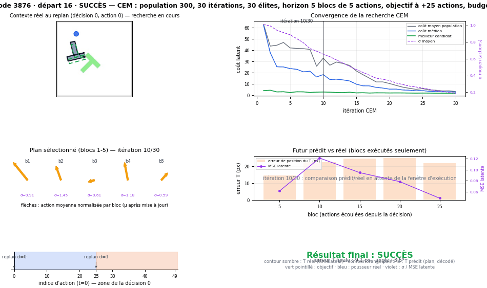
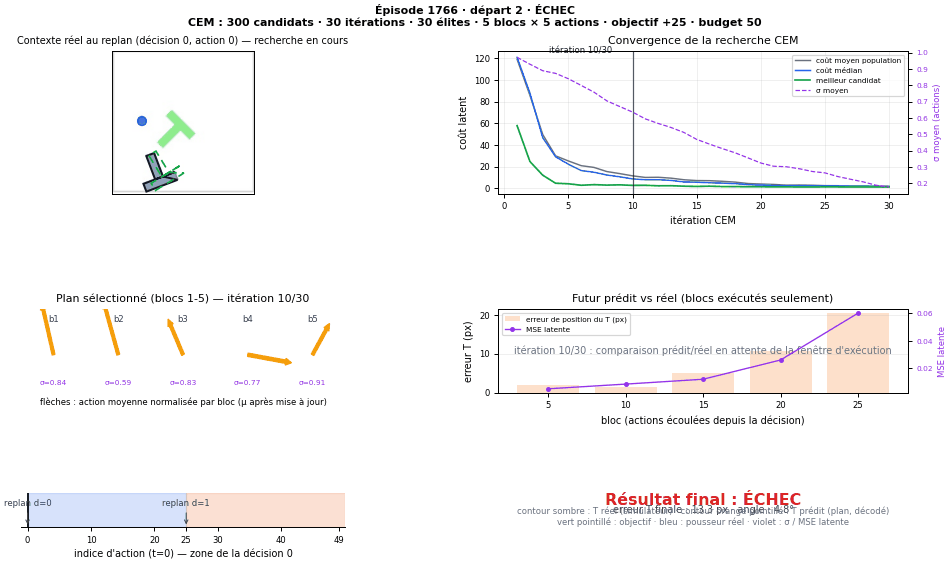

# Démonstrateur CEM reproductible de bout en bout

Ce rapport relie, pour deux épisodes PushT fixés à l'avance, l'état réel de la
scène, les deux décisions CEM prises pendant les 50 actions, la convergence de
la recherche, les plans sélectionnés, les actions réellement exécutées, les
futurs prédits par LeWM, la trajectoire obtenue et le résultat final.

Les deux épisodes sont des **exemples de communication** choisis avant
l'exécution (un succès connu et un échec connu), pas un échantillon de
performance. Leur résultat de rerun propre est rapporté tel qu'observé.

## Ce que PushT doit accomplir

Un disque bleu (le pousseur) doit amener un bloc gris en forme de T jusqu'à une
cible verte dessinée à l'avance : le T doit finir proche de la cible **et** avec
une orientation proche de la sienne. Le succès officiel exige que le rapport de
position (distance / 20 px) **et** le rapport d'angle (écart / 20°) soient tous
deux strictement inférieurs à 1. La démonstration reprend cette définition
sans la modifier.

## Ce que LeWM prédit

À partir de l'image observée et de l'image objectif, LeWM construit des
embeddings latents (192 dimensions) et, pour une suite d'actions donnée, prédit
l'évolution du latent de la scène sur 5 blocs de 5 actions. Le futur prédit est
donc une trajectoire **latente**, pas une image : pour la visualiser, on la
décode avec le décodeur structuré entraîné précédemment, qui connaît la
géométrie de PushT et sert uniquement de diagnostic.

## Ce que CEM optimise

À chaque replanification (aux actions 0 et 25), CEM échantillonne 300
candidats de 25 actions normalisées, les fait prédire par LeWM et les évalue
par le coût latent officiel : la distance entre le latent prédit au 5ᵉ bloc
(soit à +25 actions) et le latent de l'image objectif. Les 30 candidats les
moins coûteux (élites) redéfinissent la moyenne et l'écart-type de la
recherche, et on répète 30 fois.

## Comment la population se concentre

Sur les quatre décisions des deux épisodes, le coût moyen passe de 21–119 à
2–9, la médiane de 14–121 à 1,6–8,7 et le meilleur coût de 3,2–57,8 à
1,1–8,2. L'écart-type moyen des actions passe d'environ 1,0 à 0,14–0,19 : la
population d'actions, initialement dispersée sur tout l'espace normalisé, se
resserre autour d'un plan commun. Ces chiffres viennent des traces compactes,
itération par itération.

## Ce qui est réellement exécuté

Le plan final (la moyenne de la dernière itération, réévaluée par une seule
inférence) est dénormalisé par `WorldModelPolicy` et envoyé à PushT bloc par
bloc. Avec `receding_horizon=5`, les 25 actions du plan de la décision 0 sont
exécutées telles quelles (actions 0–24), puis le plan de la décision 1 est
exécuté (actions 25–49). La correspondance exacte plan → actions exécutées est
vérifiée à la tolérance `2e-6` sur les actions normalisées pour les quatre
décisions, et le tableau ci-dessous est un lien d'épisode 3876 → 1766.

## Résultats observés

| Épisode | Départ | Résultat | Erreur T finale (px) | Angle final (°) | Erreur normalisée finale |
| --- | ---: | ---: | ---: | ---: | ---: |
| 3876 | 16 | **Succès** | 9,07 | 3,54 | 0,945 |
| 1766 | 2 | **Échec** | 13,26 | 4,83 | 1,660 |

Le rerun propre a reproduit les deux résultats connus : **épisode 3876 réussi,
épisode 1766 échoué**. Les plans du rerun ne sont pas bit-à-bit identiques à
ceux de l'étude on-policy précédente (réductions GPU non déterministes), mais
les résultats des épisodes sont inchangés ; le rerun lui-même est déterministe
(voir la validation).

### Pourquoi le cas réussi réussit

Épisode 3876, départ 16 : l'erreur normalisée par rapport à la cible chute de
5,15 à l'action 0 à 0,85 à l'action 25, remonte à 3,57 à l'action 30 puis
redescend et franchit le seuil de succès à l'action 50 (0,945). Le contrôleur
ramène le T dans la zone de la cible deux fois (à 25 et à 50 actions) et finit
juste sous le seuil. La première décision produit des erreurs de prédiction
physique élevées (14–25 px sur le T, plafond du décodeur 7–11 px), mais le plan
reste suffisant pour rapprocher le T du but ; la seconde décision prédit mieux
(6–17 px, plafond 6–8 px).

### Pourquoi le cas échoué échoue

Épisode 1766, départ 2 : le T s'approche bien de la cible — l'erreur
normalisée passe de 11,94 à l'action 0 à un minimum de 1,26 à l'action 31 —
mais ne franchit **jamais** le seuil de succès, puis s'éloigne (3,13 à
l'action 45) avant de finir à 1,66. La recherche CEM de la décision 0 converge
vers un plan de coût latent très bas (1,14), mais sa prédiction dérive
physiquement sur les derniers blocs : l'erreur de position du T passe de 2,0 px
à 20,4 px et l'angle de 1,9° à 12,2° entre les blocs 1 et 5. **Ceci décrit ce
qui est observé, sans établir de causalité :** l'écart entre coût latent bas et
issue physique ratée est un fait de ce cas, pas une démonstration de mécanisme.

## L'avertissement PushT/Gymnasium, mesuré

Gymnasium signale que des observations sortent de l'espace déclaré
(`PushT._get_obs` produit des vitesses négatives alors que l'espace annonce
`[0, 512]` pour les composantes 5–6 du vecteur d'état). Mesures sur les 51
frames de chaque épisode :

| Épisode | Pousseur XY (min→max) | Vitesses (min→max) | Frames hors bornes | Relation temporelle |
| --- | --- | --- | ---: | --- |
| 3876 | x 37,0→131,6 ; y 84,8→228,1 | x −145,0→126,6 ; y −118,1→246,2 | 42/51 (composantes 5, 6) | présente dès l'action 0, épisode **réussi** |
| 1766 | x 27,3→116,4 ; y 251,0→500,3 | x −239,2→141,7 ; y −116,9→234,8 | 40/51 (composantes 5, 6) | présente dès l'action 0, épisode **échoué** |

Les deux épisodes violent les bornes déclarées dès la première frame, et l'un
réussit : cette incohérence de spécification est donc un **facteur descriptif
commun**, pas une cause démontrée de l'échec. Les observations brutes ont été
conservées sans correction.

## Ce que montrent les animations

La convention des frames des GIFs diffère de la convention d'enregistrement
« observation initiale + observation après chaque action » (51 frames). Chaque
GIF contient **57 frames** : pour chaque décision, 3 frames de recherche CEM
(itérations 10, 20 et 30 affichées depuis les traces enregistrées), puis les
observations réelles de la fenêtre d'exécution — observations 0–24 pour la
décision 0 (25 frames), observations 25–50 pour la décision 1 (26 frames).
Les offsets de replanification 0 et 25 sont vérifiés depuis
`decision_index_per_action` de l'exécution brute, pas simulés pour
l'affichage.



*Épisode 3876, départ 16 : la scène montre le T réel (contour sombre), le T
prédit par le plan (orange pointillé), la cible (vert pointillé) et le pousseur
(bleu) ; le panneau coût montre la contraction de la recherche ; le panneau
« futur prédit vs réel » ne compare que les blocs exécutés ; le chronogramme
marque les replanifications aux actions 0 et 25.*



*Épisode 1766, départ 2 : la recherche CEM de la décision 0 converge vers un
coût latent très bas, mais l'écart physique prédit/réel (bloc 5 : 20,4 px,
12,2°) décrit une trajectoire qui rate la cible ; le résultat final affiché est
ÉCHEC.*


*Synthèse : à gauche, l'état final de chaque épisode avec la pose prédite du
plan ; à droite, la convergence du meilleur coût et de l'écart-type pour les
deux décisions de chaque épisode. L'échec (en bas) converge vers un coût plus
bas que le succès (en haut) : le coût latent seul ne prédit pas le résultat.*

## Ce que la visualisation ne démontre pas

- Elle ne démontre **aucun lien causal** entre erreur de prédiction et issue :
  les deux courbes sont affichées ensemble parce que la démonstration relie
  les objets, pas parce qu'un mécanisme est établi.
- Les poses prédites sont des décodages du latent par un décodeur qui connaît
  la géométrie de PushT : une pose prédite parfaite ne prouverait pas que LeWM
  « comprend » la physique.
- La projection n'utilise ni indices de performance ni estimation de
  population : deux épisodes ne valident rien statistiquement.

## Reproduction

```bash
# depuis un clone propre (sous-module initialisé, config/local.env adaptée)
bash scripts/check_phase0.sh --require-cuda --require-assets
env PYTHONPATH=third_party/le-wm uv run --project . --with pytest pytest -q third_party/le-wm/tests
bash scripts/run_reproducible_cem_demo.sh
```

La commande vérifie l'environnement et les assets, refuse une provenance
dirty, enregistre la configuration résolue et le matériel, exécute les deux
cas avec le protocole officiel (checkpoint
`a7f1ae0cfbfad8aca613f737d66d12220fa2a8e345c5b46de8b89496c44ced62`, seed 42,
population 300, 30 itérations, 30 élites, horizon 5 blocs de 5 actions,
objectif à +25 actions, budget 50), enregistre les traces complètes et la
trajectoire réelle sous `$STABLEWM_HOME/pusht/reproducible_cem_demo/`, puis
publie les artefacts versionnés et les valide. Elle échoue avec un code non
nul si un artefact est absent ou incohérent, et n'écrit jamais dans les
répertoires on-policy existants.

## Provenance

| Élément | Valeur |
| --- | --- |
| Commit d'évaluation | `8bae6ce10f8694179212a0c1de268b3759401738` |
| Commit de post-traitement | `9fcac93f9990ebc704863e92c0a628b23e3e12ef` |
| Sous-module LeWM | `7246b262be75098f880caacaa7abf8f6c55de22b` |
| Checkpoint | `a7f1ae0cfbfad8aca613f737d66d12220fa2a8e345c5b46de8b89496c44ced62` |
| Seed | `42` |
| Matériel | NVIDIA GeForce RTX 3090, CUDA 13.0, PyTorch 2.13.0, Python 3.10.20 |
| Temps de planification | 10,74 s et 10,54 s par appel MPC batch (2 environnements) ; ≈ 5,37 s / 5,27 s par épisode-décision |

L'évaluation et le post-traitement ont initialement tourné depuis le même
commit (`8bae6ce`) ; des corrections de post-traitement (déterminisme
bit-à-bit, provenance des sidecars) ont ensuite été committées séparément et
la régénération finale a été produite au commit `9fcac93`, lui-même
vérifié par deux reruns identiques.

## Trace compacte (schéma v1)

Quatre traces versionnées (`docs/results/cem_demo_compact/`, une par
décision et par environnement, ~2,4 Mo chacune, 9,46 Mo au total) contiennent,
pour les 30 itérations : moyenne et écart-type avant/après mise à jour, coûts
min, médian, moyen, P90 et P95, coûts et actions des élites, latents terminaux
des élites, la sélection déterministe de candidats (union des indices élites
et de l'échantillon systématique 0, 10, …, 290, enregistrée avec ses indices),
les latents terminaux de cet échantillon, le plan final sélectionné, le latent
objectif, les latents réels aux frontières de blocs, les indices temporels et
les actions réellement exécutées, plus les métriques prédit/réel par bloc et
les métadonnées de forme, unités et sémantique. Les candidats non conservés ne
sont **pas** reconstructibles depuis la trace compacte (documenté dans le
schéma).

## Artefacts

- [Manifeste](results/cem_demo_manifest.json) — protocole, provenance, environnement, métriques, hashes
- [Métriques par épisode](results/cem_demo_episode_metrics.csv)
- [Traces compactes](results/cem_demo_compact/) — 4 fichiers NPZ + sidecars JSON
- [Animation succès](assets/cem_demo_success.gif) · [Animation échec](assets/cem_demo_failure.gif) · [Synthèse](assets/cem_demo_overview.png)
- Artefacts lourds (traces complètes ~68 Mo par décision, plans, exécution, contexte) : `$STABLEWM_HOME/pusht/reproducible_cem_demo/`

Tous les fichiers publiés sont listés dans le manifeste avec taille et
SHA-256 ; les chemins sont portables (`$STABLEWM_HOME/...` pour les lourds).

## Limites d'interprétation

1. Deux épisodes de communication, pas un échantillon de performance.
2. Les erreurs physiques prédit/réel dépendent du décodeur structuré (diagnostic) ; le plafond encode→décode est publié dans les traces pour séparer les sources.
3. Les temps de planification par épisode sont des estimations (un appel MPC couvre les deux environnements).
4. Les plans du rerun peuvent différer légèrement de ceux de l'étude précédente (réductions GPU non déterministes) ; les issues d'épisodes ont été reproduites à l'identique.
5. L'avertissement Gymnasium est une incohérence de spécification mesurée, pas une cause démontrée.
