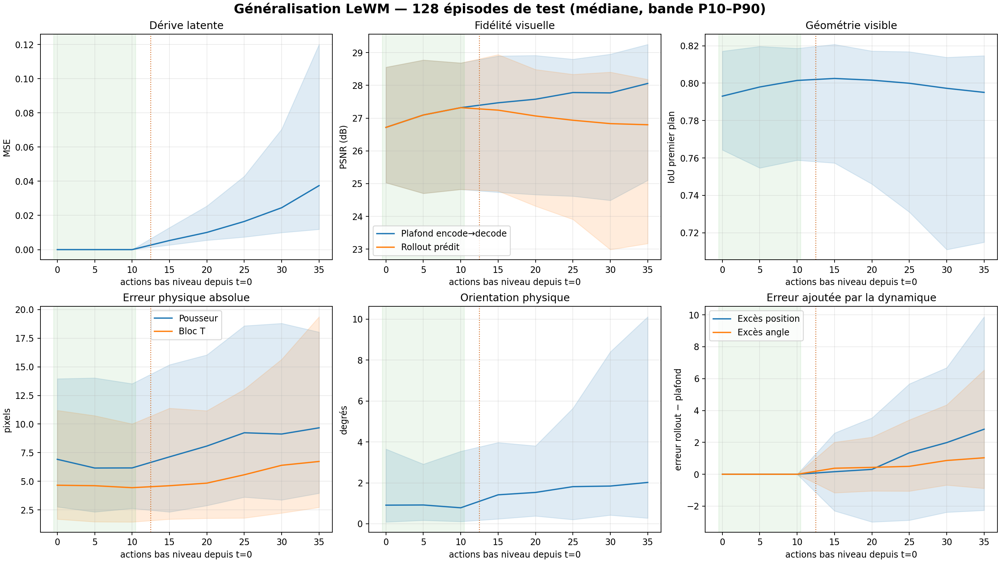
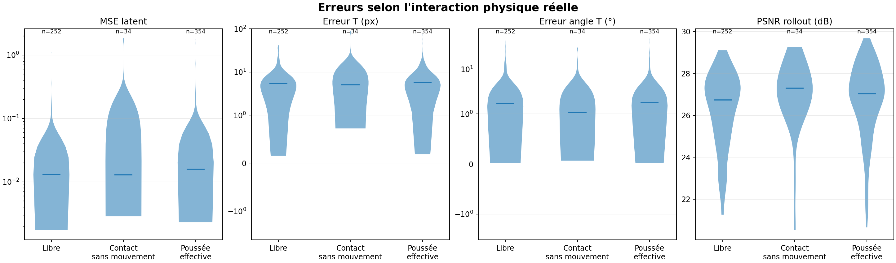
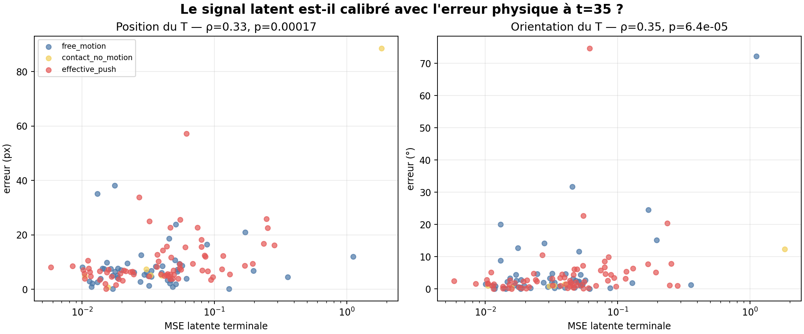
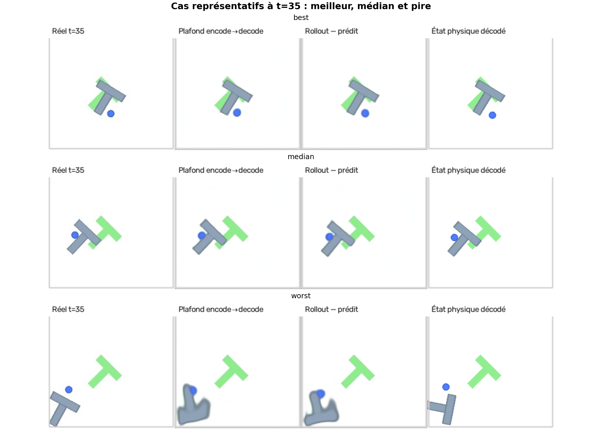
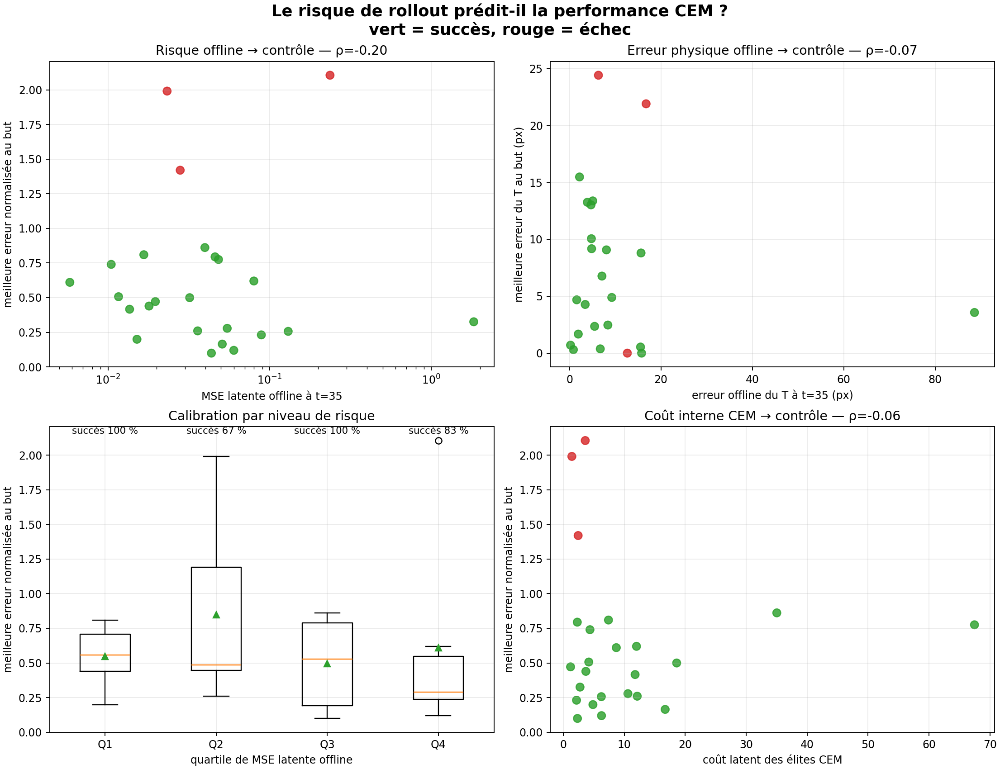

# Généralisation des rollouts LeWM et lien avec le contrôle

Date : 25 juillet 2026.

## Conclusion

Le checkpoint officiel est précis dans le cas typique, mais possède une queue
d'erreurs importante. À `t=35`, la médiane de l'erreur du T est de **6,74 px et
2,02°**, tandis que le percentile 95 atteint **25,35 px et 18,30°**.

La MSE latente est modérément corrélée à l'erreur physique sur la même
trajectoire experte (`ρ=0,33` pour la position et `ρ=0,35` pour l'angle). En
revanche, cette erreur offline ne prédit pas les échecs du contrôleur CEM lorsque
celui-ci choisit une autre séquence d'actions : sur 24 cas couvrant tout le
spectre de risque, l'AUC n'est que de **0,57**.

La prochaine validation doit donc mesurer l'erreur du modèle **sur les actions
réellement choisies et exécutées par CEM**, et non utiliser une trajectoire
experte voisine comme score de confiance.

## Protocole sur 128 épisodes

- Les 128 épisodes du split de test sont tous utilisés.
- Une fenêtre valide est tirée uniformément dans chaque épisode avec la seed
  `20260826`.
- La sélection ne consulte ni les états, ni le mouvement, ni les sorties du
  modèle.
- Chaque fenêtre contient trois images de contexte puis cinq images prédites aux
  temps `t=15,20,25,30,35`.
- Les actions enregistrées dans le HDF5 sont regroupées par blocs de cinq et
  normalisées exactement comme pendant l'entraînement LeWM.
- Le plafond encode→decode et le rollout prédit utilisent le même décodeur
  convolutionnel.
- Le décodeur structuré produit les erreurs du pousseur, de la position du T et
  de son orientation.

L'alignement des trois images de contexte donne une MSE inférieure à `10⁻⁶`.
Deux exécutions CUDA complètes produisent les mêmes SHA-256 pour les CSV, JSON,
graphiques et GIFs de généralisation.

## Généralisation à t=35

| Mesure terminale, 128 épisodes | Médiane | P90 | P95 | Maximum |
| --- | ---: | ---: | ---: | ---: |
| MSE latente | 0,0374 | 0,1200 | 0,2225 | 1,8311 |
| Erreur pousseur | 9,67 px | 18,03 px | 20,37 px | 94,53 px |
| Erreur position T | 6,74 px | 19,37 px | 25,35 px | 88,60 px |
| Erreur angle T | 2,02° | 10,11° | 18,30° | 74,70° |
| PSNR rollout | 26,80 dB | — | P5 : 21,91 dB | min. 20,53 dB |
| SSIM rollout | 0,919 | — | P5 : 0,888 | min. 0,877 |
| IoU premier plan | 0,795 | — | P5 : 0,655 | min. 0,551 |

L'erreur ajoutée par la dynamique, après soustraction de l'erreur propre au
décodeur structuré, atteint une médiane terminale de 2,82 px et 1,03°. La queue
P95 est beaucoup plus élevée : 14,51 px et 9,52°.



## Mouvement libre, contact et poussée

Chaque transition de cinq actions reçoit une classe physique :

- `libre` : aucun chevauchement exact des formes Pymunk ;
- `contact sans mouvement` : contact détecté, mais déplacement inférieur à
  2 px et rotation inférieure à 1° ;
- `poussée effective` : le T se déplace d'au moins 2 px ou tourne d'au moins 1°.

| Frames prédites | Nombre | MSE latente médiane | Erreur T médiane | Angle médian |
| --- | ---: | ---: | ---: | ---: |
| Libre | 252 | 0,0130 | 5,37 px | 1,72° |
| Contact sans mouvement | 34 | 0,0129 | 5,05 px | 1,07° |
| Poussée effective | 354 | 0,0158 | 5,66 px | 1,79° |

Les poussées ont une MSE latente légèrement plus élevée, mais les erreurs
physiques centrales restent proches. Un test de Kruskal–Wallis ne détecte pas de
différence d'erreur de position du T (`p=0,77`) ni d'angle (`p=0,13`) entre les
trois classes. Les rares catastrophes ne sont donc pas expliquées par le contact
seul.



## Calibration latent → physique

La MSE latente terminale est associée à l'erreur physique sur la trajectoire
experte :

| Relation à t=35 | Spearman ρ | p-value |
| --- | ---: | ---: |
| MSE latente → erreur position T | 0,326 | 0,00017 |
| MSE latente → erreur angle T | 0,346 | 0,000064 |

Le signal est statistiquement réel mais trop dispersé pour servir seul de
garantie physique.



Cas à inspecter :

- [meilleur cas, épisode 8535](assets/rollout_generalization_best.gif) :
  0,84 px et 0,05° à `t=35` ;
- [cas médian, épisode 1251](assets/rollout_generalization_median.gif) :
  4,83 px et 3,22° ;
- [pire cas combiné, épisode 1688](assets/rollout_generalization_worst.gif) :
  57,25 px et 74,70°.



## Lien avec CEM

Vingt-quatre épisodes sont sélectionnés à rangs régulièrement espacés après tri
des 128 fenêtres par MSE latente terminale. Ce sous-ensemble couvre donc le
spectre de risque, mais son taux de réussite ne doit pas être interprété comme
une estimation non biaisée de la population.

CEM utilise le protocole officiel : population 300, 30 itérations, 30 élites,
horizon 5, blocs de 5 actions, `receding_horizon=5`, objectif à 25 pas et budget
de 50 actions.

| Résultat du sous-ensemble stratifié | Valeur |
| --- | ---: |
| Succès | 21 / 24 |
| Échecs | 3 / 24 |
| Taux indicatif | 87,5 % |
| AUC MSE offline → échec CEM | 0,571 |
| Corrélation MSE offline → meilleure erreur au but | -0,203 (`p=0,34`) |
| Corrélation erreur T offline → meilleure erreur T au but | -0,070 (`p=0,75`) |
| Corrélation coût élite CEM → meilleure erreur au but | -0,057 (`p=0,79`) |

Le résultat est négatif et informatif : une trajectoire experte difficile à
prédire n'est pas nécessairement difficile à contrôler, et inversement. Les
trois échecs apparaissent à plusieurs niveaux de risque offline. Le coût latent
terminal des élites n'est pas non plus calibré avec la qualité physique obtenue.



## Limites

- L'erreur offline est mesurée sous les actions expertes, alors que CEM exécute
  ses propres actions. Elle mesure une difficulté locale partagée, pas l'erreur
  on-policy.
- Le sous-ensemble CEM est stratifié par risque et ne fournit pas un taux de
  réussite représentatif des 128 épisodes.
- Le critère PushT inclut la position du pousseur et la pose du T. Un épisode
  peut placer correctement le T sans satisfaire toute la condition de succès.
- Les seuils de poussée sont fixés avant l'analyse, mais restent une
  discrétisation d'une interaction continue.

## Reproduction

```bash
source scripts/_env.sh

uv run python scripts/evaluate_rollout_generalization.py \
  --config config/visual_decoder_feasibility.yaml

bash scripts/run_generalization_control.sh
```

Les résultats bruts sont écrits dans
`$STABLEWM_HOME/pusht/visual_decoder_feasibility/generalization/`.

Les copies versionnées utilisées par ce rapport sont disponibles dans
[docs/results](results/) : métriques par frame, résumés par épisode, jointure
CEM et fichiers JSON de protocole.

## Prochaine étape

Instrumenter chaque décision CEM pour sauvegarder :

1. les 25 actions finalement choisies ;
2. les latents prédits pour ces actions ;
3. les images et états réellement obtenus après chaque bloc de cinq actions ;
4. l'écart latent et physique on-policy à `t=5,10,…,25`.

Il faudra ensuite comparer `receding_horizon=5` au mode plus fermé
`receding_horizon=1` sur les mêmes épisodes. Si l'erreur on-policy explique les
échecs et diminue avec la replanification fréquente, la priorité sera une
résolution temporelle plus fine ou un modèle `action_block=1`. Sinon, il faudra
améliorer le coût CEM ou le solveur plutôt que réentraîner le décodeur.
