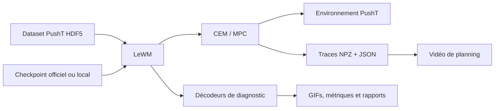

# Audit du projet — 30 juillet 2026

> **Archive historique.** Cet audit décrit le dépôt aux commits `3021360` /
> `6bb960f`, avant l'instrumentation et l'étude on-policy. Pour l'état vérifié
> actuel, consulter le [rapport de validation](validation_report.md) et la
> [roadmap](../ROADMAP.md).

## Verdict exécutif

Le dépôt est un **prototype de recherche avancé et cohérent**, mais il n'est pas
encore un projet terminé au sens de son objectif annoncé.

La chaîne fondée sur le checkpoint LeWM officiel fonctionne : installation
locale, contrôle CEM, traces détaillées, visualisation, décodage des latents et
évaluation de généralisation. La partie la mieux étayée est aujourd'hui le
**diagnostic des rollouts du checkpoint officiel**. La partie centrale encore
manquante est la démonstration qu'un LeWM entraîné localement sur la RTX 3090
apprend une représentation stable et permet un contrôle compétitif.

La direction générale est bonne. L'ordre recommandé doit toutefois être
resserré autour de quatre preuves :

1. une reproduction propre et publiable de la référence ;
2. la mesure de l'erreur **on-policy**, sous les actions choisies par CEM ;
3. un entraînement local complet avec et sans SIGReg ;
4. une comparaison CEM contre random shooting à budget égal.

Les probes avancés, la robustesse OOD, iCEM/MPPI et surtout la baseline VLA sont
des extensions utiles. Ils ne doivent pas bloquer une première version finie.

## Portée de l'audit

L'audit porte sur le commit racine `3021360` et le sous-module LeWM
`6bb960f`, avant les seuls changements documentaires issus de ce rapport.

Ont été examinés :

- le README, la roadmap et les deux rapports scientifiques ;
- les scripts, configurations, tests et modifications du fork LeWM ;
- les résultats versionnés sous `research/results/` ;
- les artefacts locaux ignorés par Git sous `.local/stablewm/` ;
- l'historique Git, le verrou de dépendances et le statut du sous-module.

Ont été exécutés :

- le contrôle de phase 0 avec CUDA et assets obligatoires : succès ;
- les 12 tests unitaires depuis le répertoire attendu du sous-module : succès ;
- les vérifications Git de cohérence et d'espace blanc : succès.

Les entraînements longs et les évaluations GPU complètes n'ont pas été relancés
pendant cet audit. Les conclusions correspondantes reposent sur les artefacts
existants et leur provenance.

## Architecture constatée



Le dépôt racine orchestre l'expérience avec `uv`, des scripts shell/Python et
des configurations figées. Le code LeWM modifié vit dans un sous-module pointant
vers un fork dédié. Les gros datasets, checkpoints, traces et vidéos sont
placés hors Git dans `STABLEWM_HOME`.

Cette séparation est saine : le dépôt reste léger et les données lourdes ne
sont pas commitées. Elle exige en contrepartie un manifeste de provenance et un
canal de publication des artefacts indispensables.

## État réel par jalon

| Jalon | État audité | Preuve disponible | Reste principal |
| --- | --- | --- | --- |
| Phase 0 — environnement | Fonctionnel sur la machine auditée | Python 3.10.20, PyTorch 2.13.0, CUDA 13.0, RTX 3090, dataset et checkpoint détectés | Refaire depuis un clone propre, enregistrer le driver et vérifier les hashes des téléchargements |
| Phase 1 — CEM de référence | Implémenté, résultat préliminaire | 5/5 succès locaux, seed et épisodes enregistrés, vidéos locales | Seconde exécution propre, résultat versionné, évaluation représentative avec intervalle d'incertitude |
| Phase 2 — traces CEM | Presque complet | Deux traces locales, métriques identiques à la phase 1, test de non-régression | Temps par itération, provenance Git propre, petite trace publiable |
| Phase 3 — visualisation | Prototype fonctionnel | MP4 local et aperçu PNG versionné | Montrer la trajectoire réellement exécutée, publier une animation autonome |
| Phase 3 bis — décodeurs | Validé dans le périmètre annoncé | Trois décodeurs, 2 048 images de test, GIFs et rapport | Publier ou reconstruire facilement les checkpoints ; ne pas confondre rendu structuré et preuve visuelle pure |
| Généralisation offline | Validée | 128 épisodes, CSV/JSON, quantiles, cas extrêmes et hashes | Aucun blocage pour ce sous-jalon |
| Lien offline → contrôle | Exploratoire, correctement limité | 24 cas stratifiés, 21 succès, AUC 0,57 | Ne pas présenter 87,5 % comme taux populationnel ; mesurer l'erreur on-policy |
| Phase 4 — entraînement local | Préparé, non réalisé | Configuration 100 époques et smoke test local de 2 batches | Run complet, checkpoint, courbes, évaluation MPC, ablation sans SIGReg |
| Phase 5 — baselines/ablations | Non commencé | Protocole prévu dans la roadmap | Random shooting à budget égal, puis balayages utiles |
| Phase 6 — probes | Amorçage indirect | Décodeur MLP non linéaire vers l'état PushT | Probes linéaires et cibles contact/distance ; comparaison entre checkpoints |
| Phase 7 — OOD | Non commencé | Intention seulement | Protocoles visuel et physique séparés |
| Phase 8 — VLA | Extension, non commencée | Étude de cadrage seulement | Environnement séparé, adaptation PushT et budget matériel à justifier |

## Ce qui est déjà solide

### Séparation des responsabilités

Le projet sépare correctement :

- la reproduction du checkpoint officiel ;
- l'instrumentation du solveur ;
- la visualisation des traces ;
- le diagnostic par décodage ;
- l'entraînement futur du modèle.

Cette séparation réduit le risque d'attribuer une erreur de rendu au modèle ou
un échec de contrôle au solveur sans preuve.

### Discipline expérimentale

Plusieurs choix sont scientifiquement bons :

- seeds et configurations explicites ;
- split train/validation/test par épisode ;
- distinction entre latents réels encodés et latents prédits ;
- quantiles et pires cas, pas seulement des moyennes ;
- budget de rollouts égal prévu pour CEM et random shooting ;
- refus d'utiliser le décodeur comme coût de planning avant validation ;
- reconnaissance explicite que l'erreur offline n'est pas l'erreur on-policy.

### Communication visuelle

Le dépôt contient déjà des figures lisibles et plusieurs GIFs. Le rapport de
généralisation relie correctement les images, les métriques et les limites
d'interprétation. C'est une bonne base pour un README destiné à plusieurs
publics.

## Blocages avant de parler de projet terminé

### 1. L'objectif « apprendre localement » n'est pas encore démontré

Le README annonce l'apprentissage d'un world model compact sur PushT. Pourtant,
les résultats principaux viennent du checkpoint officiel. La phase 4 possède
un script et une configuration, mais seulement un smoke test de deux batches a
été retrouvé localement.

Un run complet doit fournir au minimum :

- checkpoint final et checkpoint sélectionné ;
- configuration résolue, seed et versions exactes ;
- courbes de perte de prédiction et de SIGReg ;
- variance/distribution des embeddings et indicateurs de collapse ;
- métriques de rollout hors échantillon ;
- évaluation MPC sur le même protocole que le checkpoint officiel.

### 2. La performance de contrôle n'est pas encore estimée

Le résultat 5/5 de la phase 1 prouve que la chaîne fonctionne, pas que le taux de
réussite réel est proche de 100 %. Les 24 cas de l'étude de généralisation sont
sélectionnés par rang de risque ; leur taux de 87,5 % est volontairement biaisé
et ne constitue pas une estimation populationnelle.

La version 1 doit utiliser un ensemble fixé avant l'évaluation, idéalement les
128 épisodes de test déjà définis, et rapporter :

- succès par épisode et taux agrégé ;
- intervalle de confiance à 95 % ;
- coût final et meilleure proximité physique au but ;
- temps de planning et VRAM ;
- seeds, identifiants d'épisodes, commit et hash du checkpoint.

### 3. L'écart modèle/réalité n'est pas mesuré sous les actions de CEM

La généralisation offline emploie les actions expertes. CEM choisit d'autres
actions ; c'est précisément pourquoi le score offline ne prédit pas ses trois
échecs. Le prochain jalon proposé dans la roadmap est donc le bon :

- sauvegarder les actions finalement choisies ;
- comparer états et images prédits/réels à `t=5,10,…,25` ;
- comparer `receding_horizon=5` et `receding_horizon=1` ;
- décider ensuite si le problème dominant vient de la dynamique temporelle, du
  coût latent ou du solveur.

### 4. La preuve de reproductibilité reste surtout locale

Les résultats détaillés de généralisation sont versionnés. En revanche, les
métriques des phases 1 et 2, les traces NPZ et la vidéo de phase 3 vivent
uniquement sous `.local/`, donc un lecteur du clone ne peut pas les auditer.

Autres points :

- la phase 2 locale indique des arbres Git `dirty` dans sa provenance ;
- aucun workflow CI n'est présent ;
- la commande de tests n'est pas évidente : lancée naïvement depuis la racine,
  elle échoue à importer `cem_trace`, alors que les 12 tests passent depuis le
  sous-module ;
- les tests couvrent les invariants unitaires principaux, mais aucun test
  d'intégration versionné ne rejoue la chaîne GPU de bout en bout ;
- le contrôle phase 0 vérifie présence et schéma, mais pas l'intégrité par hash ;
- le fichier local `requirements_frozen.txt` de la phase 4 contient une erreur
  de `pip freeze` ; `uv.lock` épingle bien le projet, mais la provenance du run
  doit enregistrer le lock ou un export réussi ;
- aucune release ni aucun tag n'est présent.

### 5. Le dépôt n'est pas encore prêt à être distribué

Le dépôt racine ne contient ni licence propre, ni citation, ni manifeste
d'artefacts. La licence MIT du sous-module et du checkpoint officiel ne suffit
pas à définir automatiquement les droits sur le code original du dépôt racine.

Avant une version publique stable, il faut :

- choisir et ajouter une licence racine ;
- documenter les licences du code, du dataset et des checkpoints ;
- ajouter une citation ou un fichier `CITATION.cff` si le projet vise un usage
  académique ;
- publier les artefacts lourds via une release ou un stockage pérenne avec
  hashes et commandes de récupération.

## La direction est-elle la bonne ?

### Oui, sur le fond

Le chemin « référence → traces → visualisation → diagnostic → entraînement →
comparaisons » est logique. Le projet a aussi produit un résultat négatif utile :
la MSE offline ne suffit pas à prédire un échec de contrôle. C'est exactement le
type de conclusion qui évite une optimisation aveugle d'une métrique commode.

### À corriger dans l'ordre d'exécution

Le décodage visuel a reçu beaucoup d'effort avant l'entraînement local et la
baseline random shooting. Il est maintenant assez abouti. Continuer à améliorer
la netteté du décodeur aurait un rendement scientifique faible tant que les
questions de contrôle restent ouvertes.

L'ordre conseillé est :

1. fermer l'audit reproductible des phases 0–3 ;
2. réaliser l'étude on-policy ;
3. établir une référence de contrôle sur un échantillon représentatif ;
4. terminer l'entraînement local et l'ablation SIGReg ;
5. comparer CEM à random shooting à budget égal ;
6. exécuter seulement les ablations qui changent une décision ;
7. préparer une release documentée.

### Le VLA doit rester une extension séparée

Le VLA n'est pas une comparaison naturelle pour PushT : il faut adapter les
observations, la tête d'action, la fréquence de contrôle et une instruction qui
reste constante. De plus, le dépôt est figé en Python 3.10, tandis que
l'intégration LeRobot du
[`stable-worldmodel` actuel](https://github.com/galilai-group/stable-worldmodel)
annonce Python 3.12+, et la
[documentation SmolVLA](https://github.com/huggingface/lerobot/blob/main/docs/source/smolvla.mdx)
décrit un modèle de 450 M de paramètres avec une référence d'entraînement sur
A100. Cette piste doit utiliser un environnement séparé et ne pas retarder la
version 1.

## Définition proposée de « terminé »

### Niveau A — démonstrateur reproductible

Le démonstrateur peut être déclaré terminé lorsque :

- [ ] un clone propre passe l'installation, le contrôle phase 0 et les tests ;
- [ ] une commande reproduit une petite évaluation CEM avec résultat structuré ;
- [ ] au moins une métrique phase 1, une trace compacte et une animation phase 3
  sont téléchargeables avec leurs hashes ;
- [ ] l'animation montre ensemble décision CEM et trajectoire exécutée ;
- [x] le README explique PushT, les couleurs, les panneaux, le statut et les
  limites sans supposer de connaissances en world models ;
- [ ] licence, crédits et provenance des assets sont explicites.

### Niveau B — version 1 scientifique

Le projet correspondant à la promesse actuelle peut être déclaré terminé
lorsque le niveau A est atteint et que :

- [ ] l'erreur on-policy de CEM est mesurée et comparée entre les deux fréquences
  de replanification ;
- [ ] le contrôle est évalué sur le protocole de test représentatif préannoncé ;
- [ ] un entraînement local complet avec SIGReg est reproductible ;
- [ ] une ablation sans SIGReg permet de conclure, ou non, au collapse avec
  plusieurs indicateurs ;
- [ ] checkpoint officiel et checkpoint local sont comparés sur les mêmes
  épisodes ;
- [ ] CEM et random shooting sont comparés à budget total de rollouts égal ;
- [ ] les balayages de population et d'horizon annoncés sont soit exécutés, soit
  explicitement retirés du périmètre avant l'analyse ;
- [ ] les résultats bruts, figures, vidéos, configurations, hashes et limites
  sont publiés dans une release versionnée.

Les probes linéaires, l'OOD, iCEM/MPPI et le VLA peuvent former des versions
ultérieures. S'ils restent annoncés comme questions centrales dans le README,
ils deviennent en revanche des critères de finition et doivent être livrés.

## Plan média recommandé pour le README

Le README doit permettre de comprendre le projet avant toute formule. Les
visuels recommandés sont :

1. **Animation d'ouverture, 10–20 s** : réel, reconstruction et rollout prédit,
   avec légende des couleurs.
2. **Animation CEM, 15–30 s** : population dispersée puis concentrée, élites,
   coût et action exécutée.
3. **Vidéo end-to-end, 30–60 s** : un succès et un échec, avec replanifications
   visibles.
4. **Figure de synthèse** : médiane/P95 par horizon et taille de l'échantillon.

Chaque média doit avoir un texte alternatif, une légende qui explique ce qu'il
prouve et ce qu'il ne prouve pas, ainsi qu'un lien vers les métriques sources.
Pour GitHub, un GIF léger peut être intégré directement ; les MP4 plus lourds
peuvent être publiés dans une release avec une image d'aperçu cliquable.

Le README révisé dans cet audit intègre déjà un GIF représentatif, un tableau de
statut, les limites d'interprétation et une navigation vers les preuves.

## Commandes de vérification utilisées

```bash
bash scripts/check_phase0.sh --require-cuda --require-assets
```

```bash
cd third_party/le-wm
uv run --project ../.. python -m unittest discover -s tests -v
```

Résultat au 30 juillet 2026 : contrôle phase 0 réussi et 12 tests sur 12 réussis.
