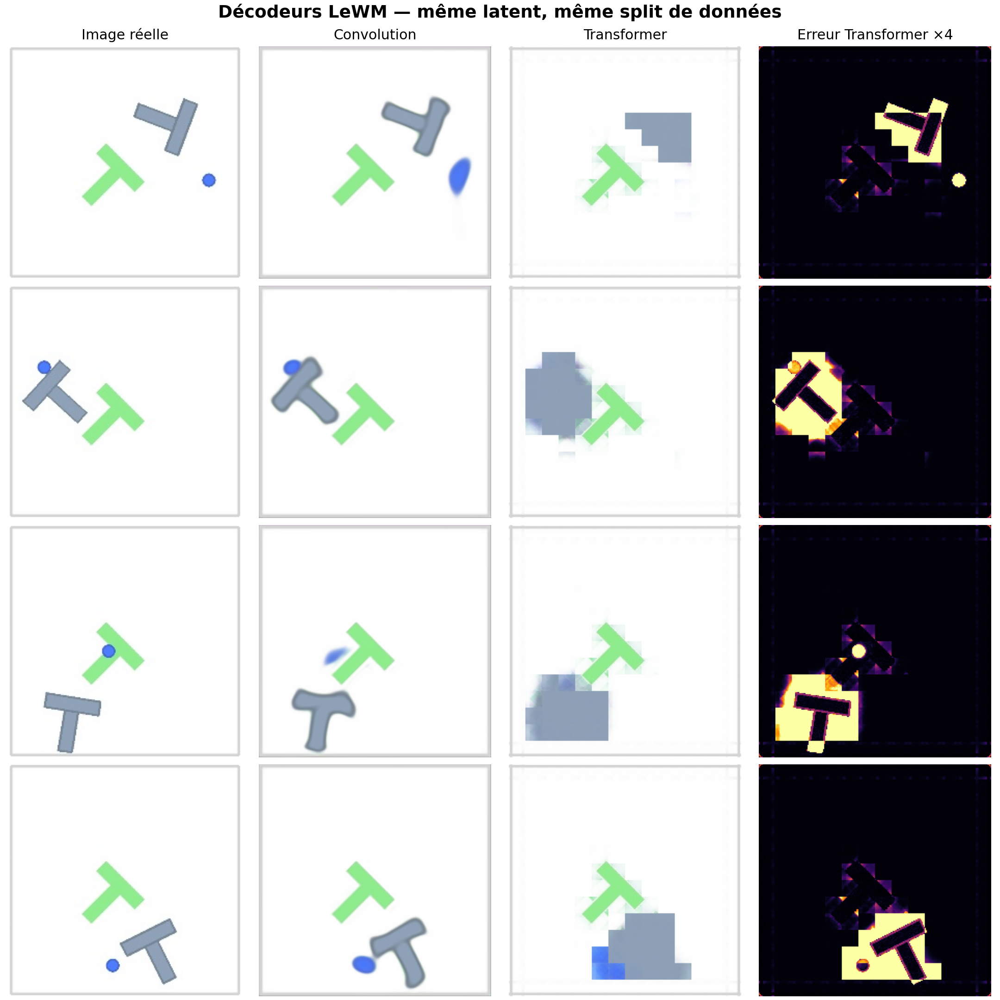
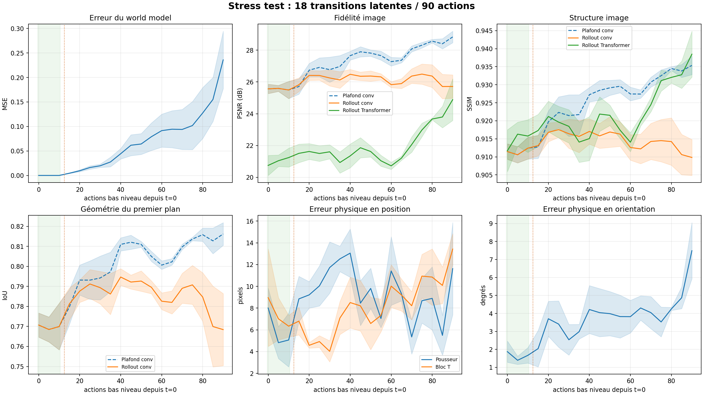
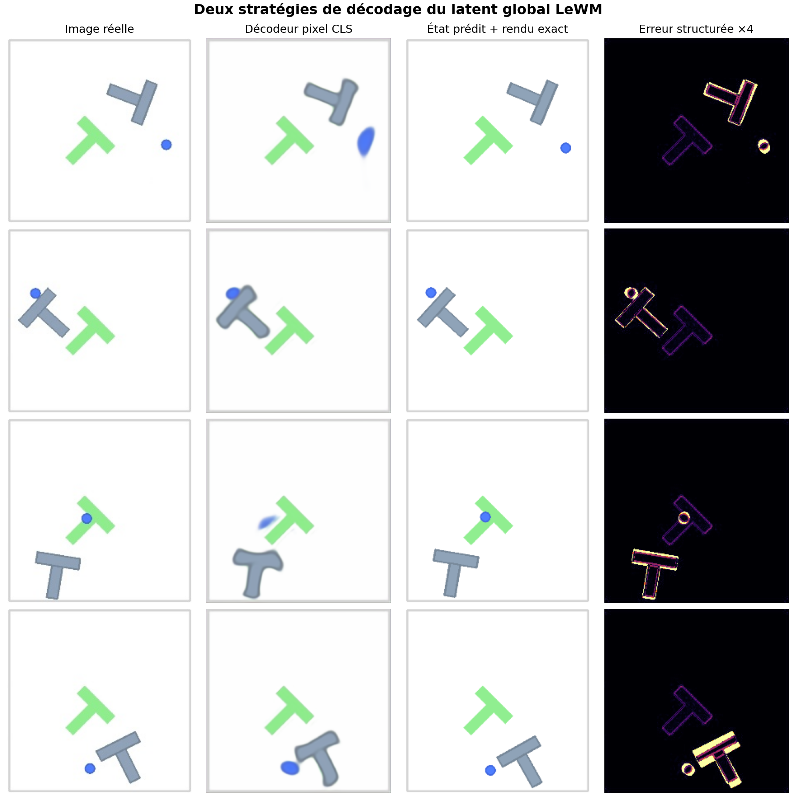

# Faisabilité du décodage visuel

Date du test : 25 juillet 2026.

## Question

Le latent global de 192 dimensions du checkpoint LeWM PushT officiel contient-il assez d'information pour reconstruire une scène utile visuellement ?

Le test mesure à la fois le plafond de reconstruction depuis des latents réels et
l'accumulation d'erreur lorsque LeWM génère ses propres latents en boucle ouverte.

## Protocole

- Encodeur et projecteur LeWM figés.
- Séparation stricte par épisode : 512 épisodes d'entraînement, 128 de validation et 128 de test.
- 10 000 images d'entraînement, 2 048 de validation et 2 048 de test.
- Quatre épisodes graphiquement divers sélectionnés dans le test pour les séquences de 18 images.
- Trois sorties apprises à partir du même latent CLS :
  1. un décodeur neuronal direct de 14,3 millions de paramètres vers une image RGB 224 × 224 ;
  2. un Transformer de 3,46 millions de paramètres inspiré de l'annexe D : 196 requêtes apprises, cross-attention vers le CLS et patches RGB 16 × 16 ;
  3. un décodeur structuré de 0,63 million de paramètres vers la position du pousseur, la position du T et son angle, suivi du moteur de rendu PushT exact.

La perte du décodeur direct surpondère le premier plan et les contours. Cela empêche le fond blanc, très facile à reconstruire, de dominer artificiellement le résultat.

| Entraînement | Images train | Époques exécutées | Meilleur checkpoint |
| --- | ---: | ---: | ---: |
| Convolution RGB | 10 000 | 30 | époque 29 |
| Transformer RGB | 10 000 | 30 | époque 30 |
| État structuré | 10 000 | 79 avec arrêt anticipé | époque 67 |

Le HDF5 complet contient 2 336 736 images issues de 18 685 épisodes. Le test
court n'en utilise donc qu'environ 0,43 % pour apprendre chaque décodeur.

## Résultats quantitatifs

### Décodeur pixel direct

| Mesure sur 2 048 images de test | Résultat |
| --- | ---: |
| PSNR | 26,67 dB |
| SSIM | 0,924 |
| IoU du premier plan | 0,787 |
| MAE pixel globale | 0,0100 |
| MAE pixel du premier plan | 0,0167 |
| Temps d'entraînement | 477 s |
| Pic VRAM | 3,28 Gio |

### Décodeur structuré

| Mesure sur 2 048 images de test | Moyenne | Médiane |
| --- | ---: | ---: |
| Erreur de position du pousseur | 8,23 px | 5,97 px |
| Erreur de position du T | 5,98 px | 4,21 px |
| Erreur angulaire du T | 2,24° | 0,89° |

92,4 % des angles du T sont prédits à moins de 5°. Le décodeur structuré a été entraîné en 8 secondes et produit toujours des formes nettes, car leur géométrie vient du simulateur.

### Comparaison convolution / Transformer

| Décodeur, même split et 10 000 images train | Paramètres | PSNR | SSIM | IoU premier plan |
| --- | ---: | ---: | ---: | ---: |
| Convolution | 14,35 M | 26,67 dB | 0,924 | 0,787 |
| Transformer à 196 requêtes | 3,46 M | 22,14 dB | 0,925 | 0,663 |

Le SSIM du Transformer paraît proche, mais il est trompeur dans cette scène très
blanche : le rendu en patches conserve les grandes structures tout en déformant
nettement les objets. Le PSNR, l'IoU et l'inspection visuelle montrent que la
convolution est ici le meilleur instrument pour observer le world model. Ce
résultat ne réfute pas le décodeur du papier : notre entraînement court n'utilise
que 10 000 images sur les 2 336 736 disponibles.



## Rollouts autorégressifs

Le protocole officiel emploie trois images de contexte aux temps `0`, `5` et
`10`, puis injecte sept blocs de cinq actions enregistrées. Il produit huit
images aux temps `0,5,…,35`, dont cinq sont réellement prédites. Les fenêtres
sont choisies automatiquement pour contenir du mouvement du T, sans consulter
les sorties du modèle.

| Moyenne sur les frames prédites de 4 épisodes de test | Officiel, jusqu'à t=35 | Stress, jusqu'à t=90 |
| --- | ---: | ---: |
| MSE latent | 0,0167 | 0,0767 |
| Plafond convolutionnel | 28,00 dB | 27,56 dB |
| Rollout convolutionnel | 27,26 dB | 26,18 dB |
| SSIM rollout | 0,923 | 0,915 |
| IoU premier plan rollout | 0,802 | 0,786 |
| Erreur pousseur | 10,07 px | 9,47 px |
| Erreur T | 5,09 px | 8,17 px |
| Erreur angle T | 2,99° | 3,94° |

À la dernière frame officielle (`t=35`), l'erreur moyenne sur le T est encore
de 4,66 px et 2,61°. À la dernière frame du stress test (`t=90`), elle atteint
13,42 px et 7,49°. La dérive est donc progressive et devient physiquement
significative avant que l'image floue ne paraisse manifestement fausse.




GIFs du protocole officiel :

- [Épisode 4475](../docs/assets/visual_decoder_rollout_04475.gif)
- [Épisode 6834](../docs/assets/visual_decoder_rollout_06834.gif)
- [Épisode 8904](../docs/assets/visual_decoder_rollout_08904.gif)
- [Épisode 16201](../docs/assets/visual_decoder_rollout_16201.gif)

Chaque GIF affiche, dans l'ordre : réel, plafond encode→decode, rollout latent
décodé, puis état physique décodé avec le moteur de rendu. Les trois premières
frames sont marquées comme contexte ; les suivantes comme prédictions.

## Inspection visuelle



Le décodeur pixel retrouve généralement la position et l'orientation globales, mais arrondit le T et transforme parfois le pousseur circulaire en ellipse. Le décodeur structuré conserve exactement les formes, les couleurs et le rendu de PushT ; son erreur devient une erreur de pose facile à voir et à mesurer.

Les quatre séquences de 18 pas sont disponibles ici :

- [Épisode 4475](assets/visual_decoder_episode_04475.gif)
- [Épisode 6834](assets/visual_decoder_episode_06834.gif)
- [Épisode 8904](assets/visual_decoder_episode_08904.gif)
- [Épisode 16201](assets/visual_decoder_episode_16201.gif)

Courbes d'entraînement :

- [Décodeur pixel](assets/visual_decoder_training_curves.png)
- [Décodeur structuré](assets/structured_decoder_training_curves.png)

## Décision

Le test de faisabilité est positif : le latent CLS encode suffisamment la configuration de PushT pour produire une représentation reconnaissable et pour estimer explicitement la pose physique.

Pour la démonstration principale, le décodeur pixel convolutionnel est la preuve
visuelle primaire : il dépend uniquement du latent et ne reçoit aucun état
privilégié. Le rendu structuré est affiché à côté comme instrument de mesure
secondaire, car il rend les erreurs physiques nettes mais connaît la géométrie
PushT. Le Transformer est conservé comme comparaison fidèle à l'idée du papier,
mais il ne doit pas remplacer la convolution avec ce budget d'entraînement.

## Limites et validation associée

- Le rendu structuré est spécifique à PushT et utilise la connaissance de la géométrie du simulateur.
- La moyenne masque quelques cas difficiles : sur l'épisode 8904, l'erreur moyenne de position du T atteint 17,46 px.
- Quatre épisodes sont suffisants pour diagnostiquer la chaîne et insuffisants
  pour estimer une distribution robuste des erreurs.
- Le checkpoint actuel fonctionne par blocs de cinq actions. Une image après
  chacune de 18 actions élémentaires nécessitera une variante entraînée avec
  `action_block=1`; le stress test actuel contient 18 transitions latentes,
  donc 90 actions et 19 images avec l'image initiale.
- Le lien avec le contrôle a été étudié sur 128 rollouts offline puis sur 24 cas
  CEM stratifiés. Les résultats sont détaillés dans le rapport de
  [généralisation](rollout_generalization.md) et dans celui consacré à
  l'[erreur on-policy](on_policy_cem_error.md).

## Reproduction

```bash
bash scripts/run_visual_decoder_feasibility.sh --rebuild-cache
```

Les checkpoints, métriques complètes et caches sont écrits dans
`$STABLEWM_HOME/pusht/visual_decoder_feasibility/`.

Pour régénérer uniquement les rollouts depuis les checkpoints existants :

```bash
source scripts/_env.sh
uv run python scripts/evaluate_decoder_rollouts.py \
  --config config/visual_decoder_feasibility.yaml
```
